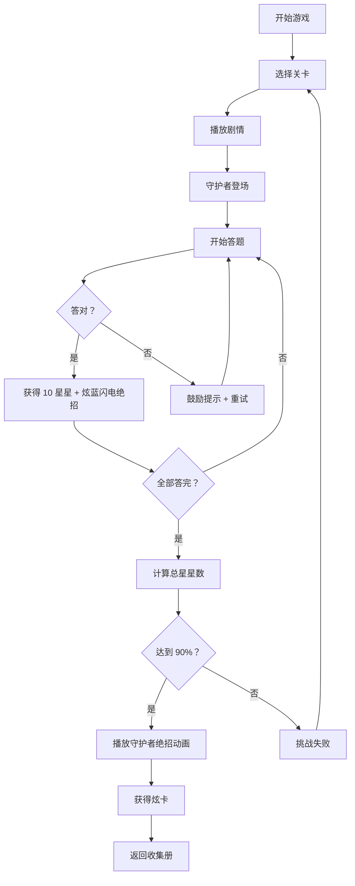
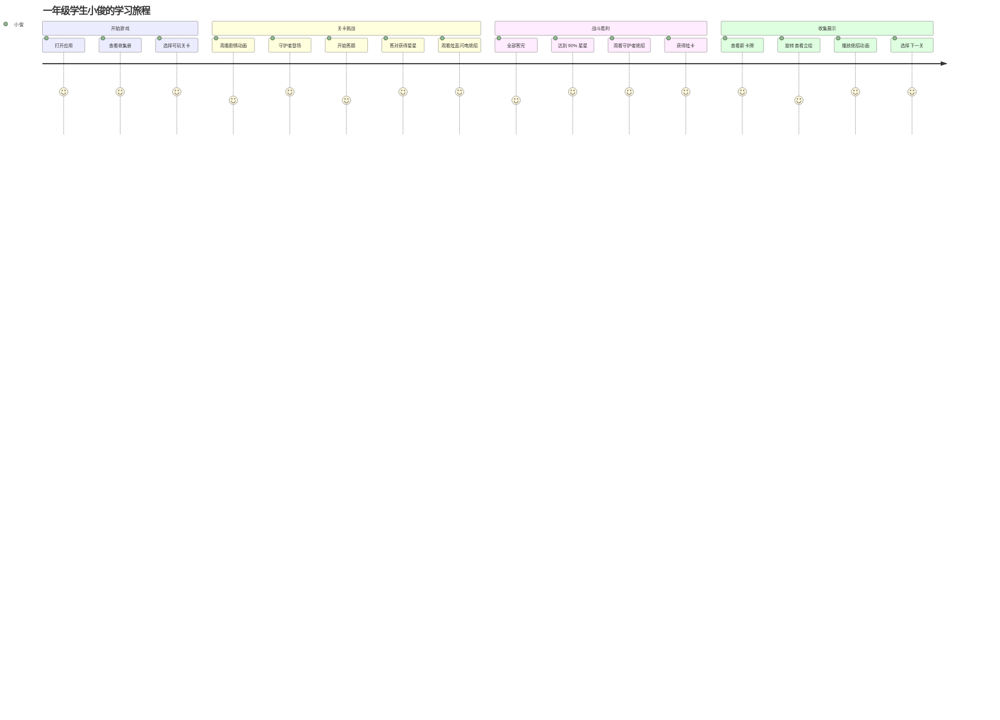
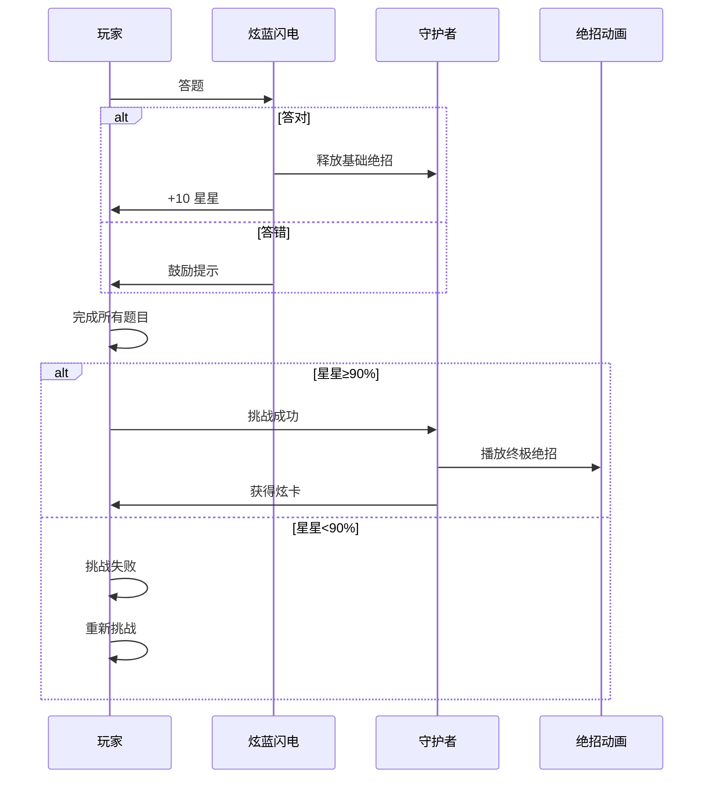
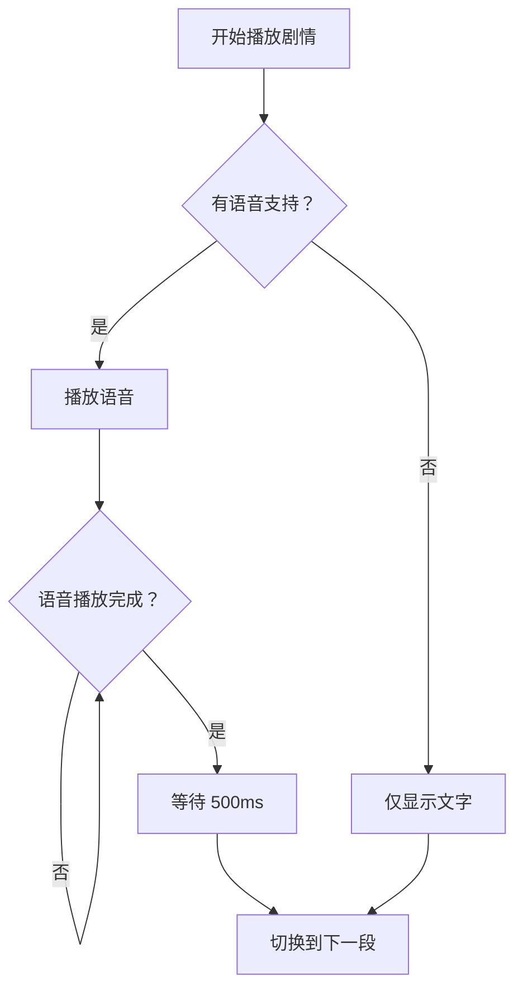

# 炫卡斗士：数学大冒险 V0.2 PRD 文档

**版本**: V0.2 完整版
**日期**: 2026-03-15
**状态**: 待开发

---

## 1. 产品概述

### 1.1 产品定位
《炫卡斗士：数学大冒险》是一款面向一年级儿童的数学学习卡牌收集游戏，将人教版一年级下学期数学课程与炫卡斗士 IP 相结合，通过答题闯关→收集星星→击败守护者→收集炫卡的循环，激发儿童学习兴趣。

### 1.2 目标用户
- **主要用户**: 6-8 岁小学一年级学生
- **次要用户**: 家长（监督学习进度）、教师（课堂教学辅助）

### 1.3 核心价值
1. **游戏化学习**: 将数学练习转化为卡牌收集游戏，提升学习动机
2. **难度递进**: 21 个关卡按教材单元设计，难度从⭐到⭐⭐⭐⭐⭐逐步提升
3. **即时反馈**: 每答对一题获得 10 颗星星，视觉化学习成果
4. **收集激励**: 21 个独特角色的炫卡收集册，激发收集欲

### 1.4 V0.2 版本范围
| 模块 | 功能 | 优先级 |
|------|------|--------|
| 关卡系统 | 21 个完整关卡设计 | P0 |
| 题型系统 | CHOICE, MULTI_SELECT, DRAG, CIRCLE, FILL_BLANK, LINK, MAZE | P0 |
| 战斗系统 | 守护者战斗、星星收集、胜利判定 | P0 |
| 绝招动画 | 21 角色独特绝招动画（Framer Motion） | P0 |
| 卡牌系统 | 收集册、卡牌详情、稀有度展示 | P0 |
| 剧情系统 | 关卡剧情、语音播放、台词显示 | P1 |
| 音效系统 | 背景音乐、答题音效、绝招音效 | P1 |

---

## 2. 功能架构

### 2.1 系统架构图
```
┌─────────────────────────────────────────────────────────────┐
│                      炫卡斗士：数学大冒险                     │
├─────────────────────────────────────────────────────────────┤
│  用户界面层                                                   │
│  ┌──────────┐ ┌──────────┐ ┌──────────┐ ┌──────────┐        │
│  │ 关卡选择 │ │ 答题界面 │ │ 战斗界面 │ │ 收集册   │        │
│  └──────────┘ └──────────┘ └──────────┘ └──────────┘        │
├─────────────────────────────────────────────────────────────┤
│  业务逻辑层                                                   │
│  ┌──────────────┐ ┌──────────────┐ ┌──────────────┐         │
│  │ 关卡管理器   │ │ 战斗管理器   │ │ 卡牌管理器   │         │
│  └──────────────┘ └──────────────┘ └──────────────┘         │
│  ┌──────────────┐ ┌──────────────┐ ┌──────────────┐         │
│  │ 题型渲染器   │ │ 绝招动画引擎 │ │ 剧情播放器   │         │
│  └──────────────┘ └──────────────┘ └──────────────┘         │
├─────────────────────────────────────────────────────────────┤
│  数据层                                                       │
│  ┌──────────────┐ ┌──────────────┐ ┌──────────────┐         │
│  │ levels.data  │ │characters.data│ │questions.data│         │
│  └──────────────┘ └──────────────┘ └──────────────┘         │
│  ┌──────────────────────────────────────────────┐            │
│  │           storageService (localStorage)       │            │
│  └──────────────────────────────────────────────┘            │
└─────────────────────────────────────────────────────────────┘
```

### 2.2 核心流程


---

## 3. 用户旅程地图

### 3.1 核心用户旅程


### 3.2 阶段划分
| 阶段 | 名称 | 关卡范围 | 难度 | 核心玩法 |
|------|------|----------|------|----------|
| 阶段 1 | 新手训练营 | 1-1 ~ 1-3 | ⭐~⭐⭐ | 认识平面图形、七巧板 |
| 阶段 2 | 进阶挑战 | 2-1 ~ 2-4 | ⭐⭐~⭐⭐⭐ | 20 以内退位减法 |
| 阶段 3 | 数字王国 | 3-1 ~ 3-4 | ⭐⭐~⭐⭐⭐⭐ | 100 以内数的认识 |
| 阶段 4 | 速度挑战 | 4-1 ~ 4-3 | ⭐⭐⭐~⭐⭐⭐⭐ | 口算加减法 |
| 阶段 5 | 精准挑战 | 5-1 ~ 5-2 | ⭐⭐⭐⭐ | 笔算加减法 |
| 阶段 6 | 终极 BOSS | 6 ~ 9 | ⭐⭐⭐⭐⭐ | 综合复习 |

---

## 4. 关卡设计（US-01 ~ US-21）

### 4.1 关卡总表
| 序号 | 关卡 ID | 单元 | 课时 | 守护者 | 难度 | 题型 | 星星阈值 |
|------|---------|------|------|--------|------|------|----------|
| 1 | 1-1 | 一、认识平面图形 | 第 1 课时 | 巨力风暴 | ⭐ | CHOICE,MULTI_SELECT,CIRCLE | 45/50 |
| 2 | 1-2 | 一、认识平面图形 | 第 2 课时 | 急救卫士 | ⭐ | CHOICE,MULTI_SELECT,SHAPE_MATCH | 45/50 |
| 3 | 1-3 | 一、认识平面图形 | 第 3 课时 | 烈火修罗 | ⭐⭐ | CHOICE,MULTI_SELECT,TANGRAM | 45/50 |
| 4 | 2-1 | 二、20 以内退位减法 | 第 1 课时 | 暗影特工 | ⭐⭐ | FILL_BLANK,CHOICE | 45/50 |
| 5 | 2-2 | 二、20 以内退位减法 | 第 2 课时 | 铁臂爵士 | ⭐⭐ | CHOICE,DRAG | 45/50 |
| 6 | 2-3 | 二、20 以内退位减法 | 第 3 课时 | 喷射加仑 | ⭐⭐⭐ | CHOICE,MULTI_SELECT,COMBO | 45/50 |
| 7 | 2-4 | 二、20 以内退位减法 | 第 4 课时 | 裂变骑士 | ⭐⭐⭐ | CHOICE,FILL_BLANK | 45/50 |
| 8 | 3-1 | 三、100 以内数的认识 | 第 1 课时 | 暴烈重卡 | ⭐⭐ | CHOICE,DRAG | 45/50 |
| 9 | 3-2 | 三、100 以内数的认识 | 第 2 课时 | 深海天锚 | ⭐⭐⭐ | CHOICE,MULTI_SELECT,MAZE | 45/50 |
| 10 | 3-3 | 三、100 以内数的认识 | 第 3 课时 | 重力金刚 | ⭐⭐⭐ | CHOICE,LINK | 45/50 |
| 11 | 3-4 | 三、100 以内数的认识 | 第 4 课时 | 玄铁战神 | ⭐⭐⭐⭐ | FILL_BLANK,CHOICE | 45/50 |
| 12 | 4-1 | 四、100 以内口算加减法 | 第 1 课时 | 炫蓝闪电 S | ⭐⭐⭐ | CHOICE,TIMED | 45/50 |
| 13 | 4-2 | 四、100 以内口算加减法 | 第 2 课时 | 焰龙战神 | ⭐⭐⭐⭐ | FILL_BLANK,CHOICE | 45/50 |
| 14 | 4-3 | 四、100 以内口算加减法 | 第 3 课时 | 霹雳火影 | ⭐⭐⭐⭐ | CHOICE,MULTI_SELECT,COMBO | 45/50 |
| 15 | 5-1 | 五、100 以内笔算加减法 | 第 1 课时 | 猎空悍将 | ⭐⭐⭐⭐ | FILL_BLANK,CHOICE | 45/50 |
| 16 | 5-2 | 五、100 以内笔算加减法 | 第 2 课时 | 钢臂力士 | ⭐⭐⭐⭐ | FILL_BLANK,DRAG | 45/50 |
| 17 | 6 | 六、数量间的加减关系 | 全单元 | 星际游侠 | ⭐⭐⭐⭐⭐ | CHOICE,FILL_BLANK,MULTI_SELECT | 80/90 |
| 18 | 7-1 | 欢乐购物街 | 第 1 课时 | 爆旋洛克 | ⭐⭐⭐ | CHOICE,DRAG | 45/50 |
| 19 | 7-2 | 欢乐购物街 | 第 2 课时 | 深海霸王 | ⭐⭐⭐⭐ | CHOICE,FILL_BLANK | 45/50 |
| 20 | 8 | 七、找规律 | 全单元 | 银翼骑士 | ⭐⭐⭐⭐⭐ | CHOICE,MULTI_SELECT,LINK | 80/90 |
| 21 | 9 | 期末综合 | 综合复习 | 重装赤魂王 | ⭐⭐⭐⭐⭐ | ALL TYPES | 90/100 |

---

### 4.2 用户故事详情

#### US-01: 关卡 1-1 认识平面图形
**守护者**: 巨力风暴 🟠
**难度**: ⭐
**前置剧情**: 小俊在建筑工地发现炫卡召唤器，巨力风暴正在搬运建材，但因为不认识图形标签，把正方形钢板和长方形钢板弄混了，导致工地混乱。

**游戏流程**:
1. 剧情播放（30 秒，可跳过）
2. 巨力风暴登场动画（五十铃自卸车→机器人变形）
3. 挑战开始（5 题，混合题型）
4. 每答对一题：炫蓝闪电释放"闪电扣杀"击中错误建材 +10 星
5. 全部答对后：播放巨力风暴绝招"超级能量冲击"
6. 获得炫卡（铜边）

**题目示例**:
| 题号 | 题型 | 题目内容 |
|------|------|----------|
| 1 | CHOICE | 这是圆形轮胎还是方形轮胎？ |
| 2 | CIRCLE | 找出所有的三角形警示牌！ |
| 3 | DRAG | 把建材拖进正确的图形仓库 |
| 4 | CHOICE | 时钟的面是什么形状？ |
| 5 | MULTI_SELECT | 这个机器人由哪些图形组成？ |

**绝招动画**: 巨力风暴释放"超级能量冲击"，用盾牌将所有建材整齐分类！
**动画时长**: 3-4 秒（铜边稀有度）
**文字特效**: 橙黄色粗体，带震动效果

---

#### US-02: 关卡 1-2 平面图形的拼图
**守护者**: 急救卫士 ⚪
**难度**: ⭐
**前置剧情**: 巨力风暴不小心受伤了，急救卫士赶来救援，但需要先拼出正确的医疗床形状！

**游戏流程**:
1. 剧情播放（急救卫士的医疗设备散落成图形碎片）
2. 急救卫士登场动画（救护车→机器人变形）
3. 挑战开始（5 题，含图形配对游戏）
4. 每答对一题：炫蓝闪电释放"百万伏特拳"点亮拼组区域 +10 星
5. 全部答对后：播放急救卫士绝招"治疗射线"
6. 获得炫卡（铜边）

**题目示例**:
| 题号 | 题型 | 题目内容 |
|------|------|----------|
| 1 | CHOICE | 用两个相同的三角形可以拼成什么图形？ |
| 2 | MULTI_SELECT | 找出下面所有的圆形！ |
| 3 | SHAPE_MATCH | 将相同的图形配对（网格配对游戏） |
| 4 | CHOICE | 长方形和正方形有什么不同？ |
| 5 | DRAG | 用四个小正方形拼成一个大正方形 |

**绝招动画**: 急救卫士释放"治疗射线"，拼组完成的医疗床发出光芒治愈巨力风暴！
**动画时长**: 3-4 秒（铜边稀有度）
**文字特效**: 白色带蓝色光晕，柔和闪烁

---

#### US-03: 关卡 1-3 七巧板
**守护者**: 烈火修罗 🔴
**难度**: ⭐⭐
**前置剧情**: 工地发生火灾，烈火修罗赶来灭火，但水炮被七巧板锁住了！

**游戏流程**:
1. 剧情播放（七巧板碎片组成了密码锁）
2. 烈火修罗登场动画（消防车→机器人变形）
3. 挑战开始（8 题，含七巧板拼图游戏）
4. 每答对一题：炫蓝闪电释放"无限爆裂"烧毁一个障碍 +10 星
5. 全部答对后：播放烈火修罗绝招"巨锤火焰"+"水流发射"
6. 获得炫卡（银边）

**题目示例**:
| 题号 | 题型 | 题目内容 |
|------|------|----------|
| 1 | CHOICE | 七巧板一共有几块？ |
| 2 | CHOICE | 七巧板里没有哪种图形？ |
| 3 | MULTI_SELECT | 七巧板中有几个三角形？ |
| 4 | TANGRAM | 用两个小三角形拼成正方形 |
| 5 | TANGRAM | 拼出一个小房子（三角形 + 正方形） |
| 6 | MULTI_SELECT | 下面哪些是七巧板可以拼成的图案？ |
| 7 | CHOICE | 七巧板中有几个正方形？ |
| 8 | CHOICE | 平行四边形有几条边？ |

**绝招动画**: 烈火修罗释放"巨锤火焰"+"水流发射"，水火交融扑灭大火！
**动画时长**: 4-5 秒（银边稀有度）
**文字特效**: 红橙色火焰风格，带燃烧粒子

---

#### US-04 ~ US-21 批量设计
（完整 21 关卡设计见附录 A）

---

## 5. 角色与卡牌系统

### 5.1 角色总表
| 序号 | 角色名 | 属性 | 载具形态 | 稀有度 | 绝招名称 |
|------|--------|------|----------|--------|----------|
| 1 | 巨力风暴 | 🟠 橙 | 五十铃自卸车 | 铜边 | 超级能量冲击 |
| 2 | 急救卫士 | ⚪ 白 | 救护车 | 铜边 | 治疗射线 |
| 3 | 烈火修罗 | 🔴 红 | 消防车 | 银边 | 巨锤火焰 + 水流发射 |
| 4 | 暗影特工 | 🟣 紫 | 直升机 | 银边 | 旋转飞镖 + 螺旋龙卷风 |
| 5 | 铁臂爵士 | 🟡 黄 | 挖掘机 | 银边 | 旋风钻击 + 螺旋剑 |
| 6 | 喷射加仑 | ⚫ 黑 | 安 -124 运输机 | 金边 | 能量之箭 + 飞鸟暴击 |
| 7 | 裂变骑士 | ⚪ 白 | 福特野马跑车 | 金边 | 裂变利劈 + 裂变反射 |
| 8 | 暴烈重卡 | 🩷 粉 | 大脚卡车 | 银边 | 蛮牛重压 + 战斧重劈 |
| 9 | 深海天锚 | ⚫ 黑 | 海盗船 | 金边 | 深海漩涡 + 天锚锁链 |
| 10 | 重力金刚 | 🟤 棕 | 推土机 | 金边 | 重力波 + 金刚护盾 |
| 11 | 玄铁战神 | ⚫ 黑 | 美式机车牵引卡车 | 彩虹边 | 玄铁重锤 + 战神之怒 |
| 12 | 炫蓝闪电 S | 🔵 蓝 | 埃文塔多警车 | 金边 | 流星重拳 + 星爆粉碎拳 |
| 13 | 焰龙战神 | 🔴🟠 红橙 | 半挂油罐车 | 彩虹边 | 焰龙地狱火 + 焰龙斩击 |
| 14 | 霹雳火影 | 🔥 火 | 丰田 86 肌肉车 | 彩虹边 | 霹雳火焰踢 + 霹雳爆裂踢 |
| 15 | 猎空悍将 | 🌪️ 风 | 雅克 -130 战斗机 | 彩虹边 | 疾风猛击 + 追踪爆弹 |
| 16 | 钢臂力士 | 🦾 银 | 神钢清障起重机 | 彩虹边 | 横扫千军 + 神力巨盾 |
| 17 | 星际游侠 | 🌌 空 | 三菱帕杰罗 SUV | 炫彩动态 | 星际穿梭 + 破空鞭击 |
| 18 | 爆旋洛克 | 🟢🔵 绿蓝 | 钻探机 | 金边 | 爆旋轰钻 + 冻结射线 |
| 19 | 深海霸王 | 🔵🌊 蓝 | 潜水艇 | 彩虹边 | 海王激光 + 海王漩涡 + 海王之怒 |
| 20 | 银翼骑士 | ⚪ 白 | 波音 C-17 运输机 | 炫彩动态 | 星辰光箭 + 银河穿刺 + 天马彗星踢 |
| 21 | 重装赤魂王 | 🔴⚫ 红黑 | 云梯消防车 + 矿用车 + 挖掘机 + 直升机合体 | 炫彩动态 | 火焰能量弹 + 毁灭能量弹 + 重装聚能炮 → 超炫电光王无限暴击 |

### 5.2 稀有度分级
| 稀有度 | 边框颜色 | 难度 | 动画时长 | 角色数量 |
|--------|----------|------|----------|----------|
| 铜边 | #CD7F32 | ⭐~⭐⭐ | 3-4 秒 | 2 个 |
| 银边 | #C0C0C0 | ⭐⭐ | 4-5 秒 | 4 个 |
| 金边 | #FFD700 | ⭐⭐⭐~⭐⭐⭐⭐ | 4-5 秒 | 7 个 |
| 彩虹边 | 动态渐变 | ⭐⭐⭐⭐ | 5-6 秒 | 6 个 |
| 炫彩动态边 | 动态光晕 | ⭐⭐⭐⭐⭐ | 6-8 秒 | 3 个 |

### 5.3 卡牌展示页 ASCII 线框图
```
┌─────────────────────────────────────┐
│         🌟 炫卡收集成果展 🌟         │
├─────────────────────────────────────┤
│  第一季：地球守护者 [9/9] ✓          │
│  ┌────┐ ┌────┐ ┌────┐ ┌────┐       │
│  │巨力│ │急救│ │烈火│ │暗影│  ...   │
│  │风暴│ │卫士│ │修罗│ │特工│       │
│  └────┘ └────┘ └────┘ └────┘       │
├─────────────────────────────────────┤
│  第二季：遗址觉醒 [6/6] ✓            │
│  ┌────┐ ┌────┐ ┌────┐ ┌────┐       │
│  │炫蓝│ │焰龙│ │霹雳│ │猎空│  ...   │
│  │闪电 S│ │战神│ │火影│ │悍将│       │
│  └────┘ └────┘ └────┘ └────┘       │
├─────────────────────────────────────┤
│  第三季：终极之战 [6/6] ✓            │
│  ┌────┐ ┌────┐ ┌────┐ ┌────┐       │
│  │重装│ │拳霸│ │疾速│ │银翼│  ...   │
│  │赤魂│ │比特│ │幻影│ │骑士│       │
│  └────┘ └────┘ └────┘ └────┘       │
├─────────────────────────────────────┤
│  总计：21/21  星级：⭐⭐⭐⭐⭐        │
│  [查看炫蓝闪电（导师）特殊动画]       │
└─────────────────────────────────────┘
```

### 5.4 卡牌详情页
- **正面**: 3D 动态立绘，可旋转查看
- **背面**: 角色数据（身高/体重/载具）、招牌绝招动画播放按钮
- **数学标签**: 该角色对应的数学知识点
- **获得日期**: 记录通关时间

---

## 6. 战斗系统

### 6.1 战斗流程


### 6.2 星星积分规则
| 项目 | 星星 | 说明 |
|------|------|------|
| 基础答题 | 10 星/题 | 每题固定奖励 |
| 连击奖励 | +2 星/连击 | 连续答对额外奖励 |
| 速度奖励 | +1 星/秒 | 限时模式剩余时间转换 |
| 完美通关 | +30 星 | 100% 正确率额外奖励 |
| 终极奖励 | +100 星 | BOSS 关卡专属 |

### 6.3 胜利条件
| 关卡难度 | 总星星 | 胜利阈值 | 通关奖励 |
|----------|--------|----------|----------|
| ⭐ | 50 | ≥45 星 | 铜边炫卡 |
| ⭐⭐ | 50 | ≥45 星 | 银边炫卡 |
| ⭐⭐⭐ | 50 | ≥45 星 | 金边炫卡 |
| ⭐⭐⭐⭐ | 50 | ≥45 星 | 彩虹边炫卡 |
| ⭐⭐⭐⭐⭐ | 100 | ≥90 星 | 炫彩动态边炫卡 |

---

## 7. 题型系统

### 7.1 题型枚举
```typescript
enum QuestionType {
  CHOICE = 'choice',           // 选择题
  MULTI_SELECT = 'multi_select', // 多选题
  DRAG = 'drag',               // 拖拽题
  CIRCLE = 'circle',           // 圈画题
  FILL_BLANK = 'fill_blank',   // 填空题
  SHAPE_MATCH = 'shape_match', // 图形配对
  TANGRAM = 'tangram',         // 七巧板
  COMBO = 'combo',             // 连击模式
  LINK = 'link',               // 连线题
  MAZE = 'maze',               // 迷宫题
  TIMED = 'timed',             // 限时模式
}
```

### 7.2 题型说明
| 题型 | 用途 | 交互方式 | 示例 |
|------|------|----------|------|
| CHOICE | 单选 | 点击选项 | "这是圆形还是方形？" |
| MULTI_SELECT | 多选 | 点击多个选项 | "找出所有的三角形！" |
| DRAG | 拖拽分类 | 拖拽到目标区域 | "把建材拖进正确的仓库" |
| CIRCLE | 圈画标记 | 点击圈画 | "圈出所有的圆形！" |
| FILL_BLANK | 填空 | 输入答案 | "15-9=__" |
| SHAPE_MATCH | 图形配对 | 点击配对 | "找出相同的图形" |
| TANGRAM | 七巧板 | 拖拽旋转 | "拼出指定图案" |
| COMBO | 连击 | 快速连续答题 | "30 秒内完成 5 题" |
| LINK | 连线 | 拖拽连线 | "连接算式和答案" |
| MAZE | 迷宫 | 点击路径 | "按数字顺序走出迷宫" |
| TIMED | 限时 | 倒计时答题 | "10 秒内作答" |

### 7.3 新题型详细设计

#### 7.3.1 图形配对游戏 (SHAPE_MATCH)
**游戏流程**:
1. 显示 N×M 网格（N,M 为偶数）
2. 每张卡片覆盖，背面显示问号
3. 玩家点击翻开两张卡片
4. 形状相同：卡片保持翻开，+10 星
5. 形状不同：卡片翻回去
6. 全部配对完成：关卡胜利

**数据结构**:
```typescript
interface ShapeCard {
  id: string;
  shape: ShapeType;
  color: ShapeColor;
  isFlipped: boolean;
  isMatched: boolean;
}

type ShapeType = 'circle' | 'triangle' | 'square' | 'rectangle';
type ShapeColor = 'red' | 'blue' | 'green' | 'yellow';
```

#### 7.3.2 七巧板拼图游戏 (TANGRAM)
**游戏流程**:
1. 显示目标图案轮廓
2. 提供 7 块七巧板（可拖拽、旋转）
3. 玩家拖拽七巧板到轮廓内
4. 全部放置正确：+10 星，播放火花特效

**数据结构**:
```typescript
interface TangramPiece {
  id: string;
  type: 'large-triangle' | 'medium-triangle' | 'small-triangle' | 'square' | 'parallelogram';
  position: { x: number; y: number };
  rotation: number;
}

interface TangramPuzzle {
  targetShape: string;
  pieces: TangramPiece[];
  tolerance: number; // 容差范围
}
```

#### 7.3.3 分步填空题 (STEP_FILL_BLANK)
**游戏流程**:
1. 显示题目和多个空白步骤
2. 玩家依次填写每个步骤
3. 每填对一个步骤：点亮该步骤，播放音效
4. 全部填对：播放完整动画

**示例**:
```
题目：计算 15 - 9 = ?

步骤 1: 15 - 5 = [10]  ← 填对后亮起
步骤 2: 10 - 4 = [6]   ← 填对后亮起

答案：15 - 9 = [6]
```

#### 7.3.4 连击模式 (COMBO)
**游戏流程**:
1. 显示倒计时（如 30 秒）
2. 快速显示 5 道题目
3. 每答对一题：立即切换下一题，+10 星 + 连击数
4. 时间结束或全部答完：结算奖励

**连击奖励**:
| 连击数 | 额外奖励 |
|--------|----------|
| 3 连击 | +5 星 |
| 5 连击 | +15 星 |
| 全对 | +30 星 |

---

## 8. UI/UX 规范

### 8.1 答题页面布局 ASCII 线框图
```
┌─────────────────────────────────────────┐
│ ←返回   关卡 1-1: 认识平面图形    ⭐120  │
├─────────────────────────────────────────┤
│  题目 3/5                               │
│  ████████████░░░░░░░░░░ 60%             │
├─────────────────────────────────────────┤
│                                         │
│           找出所有的三角形！              │
│                                         │
│    ┌─────────┐     ┌─────────┐          │
│    │  圆形   │     │ ┌─────┐ │          │
│    │   ○    │     │ │△    │ │          │
│    └─────────┘     │ │     │ │          │
│    [点击选项 A]    │ └─────┘ │ │          │
│                    └─────────┘          │
│    [点击选项 B]    三角形警示牌          │
│                                         │
│    ┌─────────┐     ┌─────────┐          │
│    │ ┌─────┐ │     │  ┌──┐  │          │
│    │ │     │ │     │  │  │  │          │
│    │ └─────┘ │     │  └──┘  │          │
│    │ 正方形  │     │ 长方形  │          │
│    └─────────┘     └─────────┘          │
│    [点击选项 C]    [点击选项 D]          │
│                                         │
├─────────────────────────────────────────┤
│  [提交]  [提示]                          │
└─────────────────────────────────────────┘
```

### 8.2 战斗结果页面布局
```
┌─────────────────────────────────────────┐
│                                         │
│              战斗结果                    │
│                                         │
│    ┌─────────────────────────────┐      │
│    │                             │      │
│    │      守护者图像 (静态)        │      │
│    │         + 背景特效           │      │
│    │                             │      │
│    └─────────────────────────────┘      │
│                                         │
│         巨力风暴 被击败了！              │
│                                         │
│    你的星星：⭐⭐⭐⭐⭐  (48/50)          │
│                                         │
│    ████████████████████░  96%           │
│                                         │
│    [播放绝招动画]  [查看卡牌]            │
│                                         │
└─────────────────────────────────────────┘
```

### 8.3 绝招动画页面布局
```
┌─────────────────────────────────────────┐
│                                         │
│    ╔═══════════════════════════════╗    │
│    ║                               ║    │
│    ║     超级能量冲击！            ║    │
│    ║     (橙黄色震动文字)           ║    │
│    ║                               ║    │
│    ║         [角色图像]            ║    │
│    ║      (浮动 + 缩放动画)         ║    │
│    ║                               ║    │
│    ║     ═══════════════           ║    │
│    ║    (冲击波 CSS 展开)            ║    │
│    ║                               ║    │
│    ╚═══════════════════════════════╝    │
│                                         │
│              [跳过]                      │
│                                         │
└─────────────────────────────────────────┘
```

### 8.4 交互反馈规范
| 操作 | 视觉反馈 | 音效反馈 | 时长 |
|------|----------|----------|------|
| 悬停选项 | 边框高亮 + 放大 5% | 无 | 200ms |
| 点击选项 | 按下效果 + 颜色变化 | 点击音效 | 150ms |
| 答对 | 绿色闪光 + 星星飞入 | 成功音效 | 500ms |
| 答错 | 红色晃动 + 鼓励文字 | 失败音效 | 500ms |
| 连击 | 连击数字放大 + 火焰特效 | 连击音效 | 300ms |
| 胜利 | 金色闪光 + 星星雨 | 胜利音乐 | 2000ms |

---

## 9. 语音与音效

### 9.1 语音内容
| 场景 | 语音内容 | 语音类型 |
|------|----------|----------|
| 剧情播放 | 炫蓝闪电台词 + 旁白 | Web Speech API |
| 绝招展示 | 完整绝招台词 | Web Speech API |
| 答题反馈 | "答对了！" / "再试试！" | 音效 |
| 战斗胜利 | "你击败了守护者！" | Web Speech API |
| 获得卡牌 | "[角色名] 已收入炫卡召唤器" | Web Speech API |

### 9.2 音效列表
| 音效名称 | 用途 | 时长 |
|----------|------|------|
| bgm_main | 主界面背景音乐 | 循环 |
| bgm_battle | 战斗背景音乐 | 循环 |
| sfx_click | 点击按钮 | 100ms |
| sfx_correct | 答对题目 | 500ms |
| sfx_wrong | 答错题目 | 500ms |
| sfx_star_collect | 收集星星 | 300ms |
| sfx_combo | 连击 | 200ms |
| sfx_victory | 战斗胜利 | 2000ms |
| sfx_ultimate | 绝招释放 | 3000ms |

### 9.3 语音播放逻辑


---

## 10. 技术架构

### 10.1 组件架构
```
src/
├── features/
│   ├── home/           # 首页
│   ├── level/          # 关卡选择
│   ├── quiz/           # 答题模块
│   │   ├── quiz-game/
│   │   ├── quiz-progress/
│   │   └── question-types/
│   │       ├── choice-question/
│   │       ├── multi-select-question/
│   │       ├── drag-question/
│   │       ├── circle-question/
│   │       ├── fill-blank-question/
│   │       ├── shape-matching-game/
│   │       └── tangram-game/
│   ├── story/          # 剧情模块
│   │   └── story-player/
│   ├── battle/         # 战斗模块
│   │   ├── battle-screen/
│   │   └── ultimate-animation/
│   └── card/           # 卡牌模块
│       ├── card-collection/
│       ├── card-detail/
│       └── card-reveal/
├── shared/
│   ├── components/     # 公共组件
│   └── hooks/          # 公共 Hook
├── services/
│   ├── storage.service.ts
│   ├── sound.service.ts
│   └── speech.service.ts
├── data/
│   ├── characters.data.ts
│   ├── levels.data.ts
│   └── questions.data.ts
└── config/
    └── game.config.ts
```

### 10.2 状态管理
- **全局状态**: Zustand Store
  - `userProgress`: 用户进度（已通关关卡、星星总数）
  - `cardCollection`: 收集册（已收集卡牌）
  - `settings`: 设置（音效开关、语音开关）
- **局部状态**: React useState/useReducer
  - 答题状态、战斗状态、剧情播放状态

### 10.3 数据存储
```typescript
interface StorageData {
  userProgress: {
    completedLevels: string[];
    levelStars: Record<string, number>;
  };
  cardCollection: {
    collectedCards: Array<{
      characterId: string;
      obtainedDate: string;
      stars: number;
    }>;
  };
  settings: {
    soundEnabled: boolean;
    voiceEnabled: boolean;
  };
}
```

---

## 11. 验收标准

### 11.1 功能验收
| 功能 | 验收标准 | 优先级 |
|------|----------|--------|
| 关卡选择 | 21 个关卡可选择、难度显示正确 | P0 |
| 剧情播放 | 语音 + 文字同步播放，可跳过 | P0 |
| 答题系统 | 11 种题型全部可正常交互 | P0 |
| 星星积分 | 答对 +10 星，连击奖励正确 | P0 |
| 战斗胜利 | 达到 90% 星星可击败守护者 | P0 |
| 绝招动画 | 21 个角色动画正常播放 | P0 |
| 卡牌收集 | 获得卡牌并显示在收集册 | P0 |
| 数据存储 | 刷新后进度不丢失 | P0 |

### 11.2 性能验收
| 指标 | 目标 | 测量方式 |
|------|------|----------|
| 首屏加载 | < 2 秒 | Lighthouse |
| 答题响应 | < 100ms | Performance API |
| 动画帧率 | ≥ 30 FPS | DevTools Performance |
| 包体积 | < 5 MB (gzip) | Webpack Bundle Analyzer |

### 11.3 兼容性验收
| 平台 | 版本要求 |
|------|----------|
| Chrome | 90+ |
| Safari | 14+ |
| Edge | 90+ |
| iPad Safari | 14+ |
| Android Chrome | 90+ |

### 11.4 可用性验收（儿童友好）
| 项目 | 验收标准 |
|------|----------|
| 字体大小 | ≥ 18px，清晰可读 |
| 按钮尺寸 | ≥ 48×48px，易于点击 |
| 颜色对比 | WCAG AA 标准以上 |
| 操作容错 | 答错可重试，无惩罚 |
| 引导提示 | 每道题有"提示"按钮 |
| 视觉反馈 | 所有交互有即时视觉反馈 |

---

## 附录 A: 完整 21 关卡设计

### US-04: 关卡 2-1 十几减 9（暗影特工）
- **题型**: FILL_BLANK（破十法分步填空）
- **绝招**: 旋转飞镖 + 螺旋龙卷风
- **文字特效**: 紫色暗影风格，带飞镖轨迹

### US-05: 关卡 2-2 十几减 8、7、6（铁臂爵士）
- **题型**: CHOICE, DRAG
- **绝招**: 旋风钻击 + 螺旋剑
- **文字特效**: 黄色金属质感，带钻头旋转

### US-06: 关卡 2-3 十几减 5、4、3、2（喷射加仑）
- **题型**: CHOICE, COMBO（连击模式）
- **绝招**: 能量之箭 + 飞鸟暴击
- **文字特效**: 黑色带喷射粒子

### US-07: 关卡 2-4 解决问题（裂变骑士）⭐BOSS
- **题型**: CHOICE, FILL_BLANK
- **绝招**: 裂变利劈 + 裂变反射
- **文字特效**: 白色裂纹效果

### US-08: 关卡 3-1 数数、数的组成（暴烈重卡）
- **题型**: CHOICE, DRAG
- **绝招**: 蛮牛重压 + 战斧重劈
- **文字特效**: 粉色重卡风格，带震动

### US-09: 关卡 3-2 数的顺序（深海天锚）
- **题型**: CHOICE, MAZE（百数表迷宫）
- **绝招**: 深海漩涡 + 天锚锁链
- **文字特效**: 深蓝色水流效果

### US-10: 关卡 3-3 比较大小（重力金刚）
- **题型**: CHOICE, LINK（连线比较）
- **绝招**: 重力波 + 金刚护盾
- **文字特效**: 棕色重力扭曲效果

### US-11: 关卡 3-4 简单的加减法（玄铁战神）⭐BOSS
- **题型**: FILL_BLANK, CHOICE
- **绝招**: 玄铁重锤 + 战神之怒
- **文字特效**: 黑色金属裂纹

### US-12: 关卡 4-1 口算加法（炫蓝闪电 S）
- **题型**: CHOICE, TIMED（限时模式）
- **绝招**: 流星重拳 + 星爆粉碎拳
- **文字特效**: 蓝色闪电风格

### US-13: 关卡 4-2 口算减法（焰龙战神）⭐BOSS
- **题型**: FILL_BLANK, CHOICE
- **绝招**: 焰龙地狱火 + 焰龙斩击
- **文字特效**: 红橙火焰燃烧

### US-14: 关卡 4-3 解决问题（霹雳火影）⭐BOSS
- **题型**: CHOICE, MULTI_SELECT, COMBO
- **绝招**: 霹雳火焰踢 + 霹雳爆裂踢
- **文字特效**: 火焰踢击轨迹

### US-15: 关卡 5-1 笔算加法（猎空悍将）⭐BOSS
- **题型**: FILL_BLANK（竖式填空）
- **绝招**: 疾风猛击 + 追踪爆弹
- **文字特效**: 绿色风系效果

### US-16: 关卡 5-2 笔算减法（钢臂力士）⭐BOSS
- **题型**: FILL_BLANK（竖式填空）, DRAG
- **绝招**: 横扫千军 + 神力巨盾
- **文字特效**: 银色金属四臂效果

### US-17: 关卡 6 数量间的加减关系（星际游侠）⭐终极 BOSS
- **题型**: CHOICE, FILL_BLANK, MULTI_SELECT（9 题综合）
- **绝招**: 星际穿梭 + 破空鞭击
- **文字特效**: 星空穿梭动态效果

### US-18: 关卡 7-1 认识人民币（爆旋洛克）
- **题型**: CHOICE, DRAG
- **绝招**: 爆旋轰钻 + 冻结射线
- **文字特效**: 绿蓝钻头 + 冰冻效果

### US-19: 关卡 7-2 买卖我做主（深海霸王）⭐BOSS
- **题型**: CHOICE, FILL_BLANK
- **绝招**: 海王激光 + 海王漩涡 + 海王之怒
- **文字特效**: 深蓝海王三叉戟

### US-20: 关卡 8 找规律（银翼骑士）⭐终极 BOSS
- **题型**: CHOICE, MULTI_SELECT, LINK
- **绝招**: 星辰光箭 + 银河穿刺 + 天马彗星踢
- **文字特效**: 白色星光轨迹

### US-21: 关卡 9 期末综合（重装赤魂王）⭐最终 BOSS
- **题型**: ALL TYPES（10 题综合）
- **绝招**: 火焰能量弹 + 毁灭能量弹 + 重装聚能炮 → 超炫电光王无限暴击
- **文字特效**: 红黑四合一合体效果

---

## 附录 B: 术语表

| 术语 | 定义 |
|------|------|
| 炫卡斗士 | 游戏 IP 角色，每个角色对应一个关卡守护者 |
| 炫卡召唤器 | 卡牌收集册，展示已收集的角色卡牌 |
| 炫蓝闪电 | 导师角色，指导玩家进行游戏 |
| 星星积分 | 答题获得的货币，用于判定战斗胜利 |
| 绝招动画 | 守护者被击败时播放的独特动画 |
| 稀有度 | 卡牌边框颜色，对应关卡难度 |

---

## 附录 C: 变更日志

| 版本 | 日期 | 变更内容 |
|------|------|----------|
| V0.1 | 2026-03-XX | MVP 版本（剧情播放优化、基础答题系统） |
| V0.2 | 2026-03-15 | 完整版（21 关卡、绝招动画、卡牌收集） |
