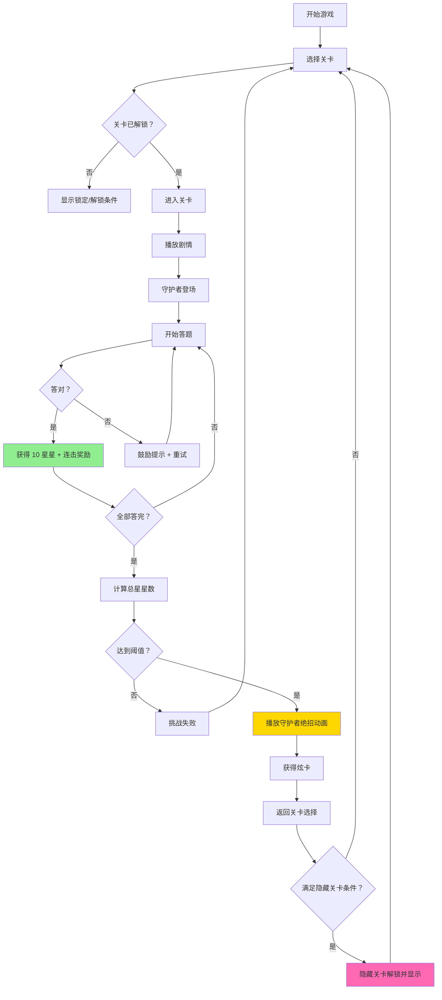
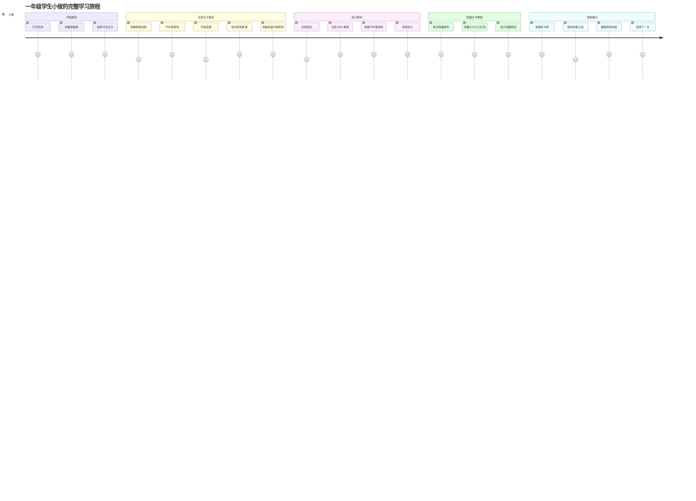

# 炫卡斗士：数学大冒险 V0.2.1 PRD 文档

**版本**: V0.2.1 完整版（内容增强）
**日期**: 2026-03-21
**状态**: 待开发

---

## 1. 产品概述

### 1.1 产品定位
《炫卡斗士：数学大冒险》是一款面向一年级儿童的数学学习卡牌收集游戏，将人教版一年级下学期数学课程与炫卡斗士 IP 相结合，通过答题闯关→收集星星→击败守护者→收集炫卡的循环，激发儿童学习兴趣。

### 1.2 目标用户
- **主要用户**: 6-8 岁小学一年级学生
- **次要用户**: 家长（监督学习进度）、教师（课堂教学辅助）

### 1.3 核心价值
1. **游戏化学习**: 将数学练习转化为卡牌收集游戏，提升学习动机
2. **难度递进**: 21 个主线关卡 + 2 个隐藏关卡，难度从⭐到⭐⭐⭐⭐⭐逐步提升
3. **即时反馈**: 每答对一题获得 10 颗星星，视觉化学习成果
4. **收集激励**: 26 个独特角色（含隐藏）的炫卡收集册，激发收集欲

### 1.4 V0.2 版本范围
| 模块 | 功能 | 优先级 | 状态 |
|------|------|--------|------|
| 关卡系统 | 21 个主线关卡设计 | P0 | ✅ 已完成 |
| 题型系统 | CHOICE, MULTI_SELECT, DRAG, CIRCLE, FILL_BLANK, LINK, MAZE, SHAPE_MATCH, TANGRAM, COMBO, TIMED | P0 | ✅ 已完成 |
| 战斗系统 | 守护者战斗、星星收集、胜利判定 | P0 | ✅ 已完成 |
| 绝招动画 | 21 角色独特绝招动画（Framer Motion） | P0 | ✅ 已完成 |
| 卡牌系统 | 收集册、卡牌详情、稀有度展示 | P0 | ✅ 已完成 |
| 剧情系统 | 关卡剧情、语音播放、台词显示 | P1 | ✅ 已完成 |

### 1.5 V0.2.1 新增内容
| 模块 | 功能 | 优先级 | 说明 |
|------|------|--------|------|
| 隐藏关卡 | 超炫电光王的秘密基地 | P0 | 5 题递进式数位理解挑战 |
| 隐藏关卡 | 炫蓝雷霆王的时空裂缝 | P0 | 4 题跨单元综合挑战 |
| 角色重设计 | 星际游侠（R17） | P0 | 单元调整为"数量间的加减关系" |
| 角色重设计 | 爆旋洛克（R18） | P0 | 单元调整为"求一个数比另一个数多（少）几" |
| 角色重设计 | 深海霸王（R19） | P0 | 单元调整为"求比一个数多（少）几的数是多少" |
| 角色重设计 | 银翼骑士（R20） | P0 | 单元调整为"连续两问的问题" |
| 角色重设计 | 拳霸比特（R21） | P0 | 单元调整为"认识人民币" |
| 角色重设计 | 疾速幻影（R22） | P0 | 单元调整为"买卖我做主"（限时挑战） |
| 角色重设计 | 重轨巨神（R23） | P0 | 单元调整为"找规律"（8 题） |
| 角色重设计 | 重装赤魂王（R24） | P0 | 期末综合四阶段 BOSS 战（10 题+4 附加题） |

---

## 2. 功能架构

### 2.1 系统架构图
```
┌─────────────────────────────────────────────────────────────┐
│                      炫卡斗士：数学大冒险 V0.2.1              │
├─────────────────────────────────────────────────────────────┤
│  用户界面层                                                   │
│  ┌──────────┐ ┌──────────┐ ┌──────────┐ ┌──────────┐        │
│  │ 关卡选择 │ │ 答题界面 │ │ 战斗界面 │ │ 收集册   │        │
│  └──────────┘ └──────────┘ └──────────┘ └──────────┘        │
│  ┌──────────────────────────────────────────────┐            │
│  │           隐藏关卡入口（条件解锁）             │            │
│  └──────────────────────────────────────────────┘            │
├─────────────────────────────────────────────────────────────┤
│  业务逻辑层                                                   │
│  ┌──────────────┐ ┌──────────────┐ ┌──────────────┐         │
│  │ 关卡管理器   │ │ 战斗管理器   │ │ 卡牌管理器   │         │
│  └──────────────┘ └──────────────┘ └──────────────┘         │
│  ┌──────────────┐ ┌──────────────┐ ┌──────────────┐         │
│  │ 题型渲染器   │ │ 绝招动画引擎 │ │ 剧情播放器   │         │
│  └──────────────┘ └──────────────┘ └──────────────┘         │
│  ┌──────────────────────────────────────────────┐            │
│  │        隐藏关卡解锁条件检查器                  │            │
│  └──────────────────────────────────────────────┘            │
├─────────────────────────────────────────────────────────────┤
│  数据层                                                       │
│  ┌──────────────┐ ┌──────────────┐ ┌──────────────┐         │
│  │ levels.data  │ │characters.data│ │questions.data│         │
│  └──────────────┘ └──────────────┘ └──────────────┘         │
│  ┌──────────────────────────────────────────────┐            │
│  │           storageService (localStorage)       │            │
│  └──────────────────────────────────────────────┘            │
└─────────────────────────────────────────────────────────────┘
```

### 2.2 核心流程


---

## 3. 用户旅程地图

### 3.1 核心用户旅程（含隐藏关卡）


### 3.2 阶段划分
| 阶段 | 名称 | 关卡范围 | 难度 | 核心玩法 |
|------|------|----------|------|----------|
| 阶段 1 | 新手训练营 | 1-1 ~ 1-3 | ⭐~⭐⭐ | 认识平面图形、七巧板 |
| 阶段 2 | 进阶挑战 | 2-1 ~ 2-4 | ⭐⭐~⭐⭐⭐ | 20 以内退位减法 |
| 阶段 3 | 数字王国 | 3-1 ~ 3-4 | ⭐⭐~⭐⭐⭐⭐ | 100 以内数的认识 |
| 阶段 4 | 速度挑战 | 4-1 ~ 4-3 | ⭐⭐⭐~⭐⭐⭐⭐ | 口算加减法 |
| 阶段 5 | 精准挑战 | 5-1 ~ 5-2 | ⭐⭐⭐⭐ | 笔算加减法 |
| 阶段 6 | 终极 BOSS | 6 ~ 9 | ⭐⭐⭐⭐⭐ | 综合复习 |
| 阶段 7 | 隐藏挑战 | H1 ~ H2 | ⭐⭐⭐⭐⭐ | 数位理解、跨单元综合 |

---

## 4. 隐藏关卡设计

### 4.1 隐藏关卡 1：超炫电光王的秘密基地

**关卡 ID**: H1
**守护者**: 超炫电光王
**难度**: ⭐⭐⭐⭐⭐
**稀有度**: 动态彩虹边
**对应知识**: 三、100 以内数的认识 - 摆一摆，想一想

#### 4.1.1 解锁条件
| 条件 | 要求 | 逻辑 |
|------|------|------|
| 单元 1-3 通关 | 全部三星通关 | AND |
| 星星收集 | 收集 100 星星 | AND |

**显示规则**: 达到条件后才显示在关卡选择界面

#### 4.1.2 剧情
> 小俊在整理炫卡时，发现超炫电光王的卡片发出神秘光芒！原来这是第一季隐藏 BOSS 的考验，只有真正理解数字组成的孩子才能进入他的秘密基地。

#### 4.1.3 关卡流程（5 题递进）
| 阶段 | 题型 | 题目内容 | 互动机制 | 星星奖励 |
|------|------|----------|----------|----------|
| 1 | 数位理解 | 用 3 个圆片在数位表上能摆出哪些数？ | 拖拽圆片到十位/个位 | 10 星 |
| 2 | 最大最小 | 用 5 个圆片摆出的最大数是？最小数是？ | 滑动调整数位 | 10 星 |
| 3 | 规律发现 | 圆片数与能摆出的数的个数有什么关系？ | 填写发现 | 10 星 |
| 4 | 逆向思维 | 能摆出 12,21,30 这三个数，至少需要几个圆片？ | 选择答案 | 10 星 |
| 5 | 挑战极限 | 用 9 个圆片能摆出几个不同的数？全部列出来 | 限时填写（30 秒） | 10 星 |

**连击奖励**: 启用

#### 4.1.4 奖励
- **炫卡**: 超炫电光王传说卡（动态彩虹边）
- **特殊技能**: "数位透视"（永久有效，在后续关卡中自动显示数位提示）

#### 4.1.5 ASCII 线框图（隐藏关卡入口）
```
┌─────────────────────────────────────────┐
│         🌟 关卡选择 🌟                   │
├─────────────────────────────────────────┤
│  主线关卡                                │
│  [1-1✓] [1-2✓] [1-3✓] [2-1✓] ...       │
│  [2-2✓] [2-3✓] [2-4✓] [3-1✓] ...       │
│  ...                                    │
├─────────────────────────────────────────┤
│  隐藏关卡 ⭐ NEW!                        │
│  ┌─────────────────────────────────┐    │
│  │  ✨ 超炫电光王的秘密基地 ✨      │    │
│  │     解锁条件：已完成            │    │
│  │     [进入挑战]                   │    │
│  └─────────────────────────────────┘    │
│  ┌─────────────────────────────────┐    │
│  │  🔒 炫蓝雷霆王的时空裂缝        │    │
│  │     解锁条件：完成期末综合 1     │    │
│  │              且正确率≥90%        │    │
│  └─────────────────────────────────┘    │
└─────────────────────────────────────────┘
```

---

### 4.2 隐藏关卡 2：炫蓝雷霆王的时空裂缝

**关卡 ID**: H2
**守护者**: 炫蓝雷霆王
**难度**: ⭐⭐⭐⭐⭐（终极 BOSS 级）
**稀有度**: 炫彩动态边 + 雷电特效
**对应知识**: 期末综合 2 - 应用提升

#### 4.2.1 解锁条件
| 条件 | 要求 | 逻辑 |
|------|------|------|
| 期末综合 1 | 完成且正确率≥90% | 单独条件 |

**显示规则**: 达到条件后才显示在关卡选择界面

#### 4.2.2 剧情
> 击败重装赤魂王后，时空出现裂缝！炫蓝闪电的终极形态炫蓝雷霆王从未来穿越而来，带来更高阶的数学挑战！

#### 4.2.3 关卡流程（4 题跨单元综合）
| 阶段 | 知识领域 | 综合题型 | 难度 | 星星奖励 |
|------|----------|----------|------|----------|
| 1 | 图形 + 计算 | 用七巧板拼出数字"8"，然后计算 88-59=？ | ⭐⭐⭐ | 10 星 |
| 2 | 人民币 + 退位减 | 有 100 元，买 3 件商品（价格需退位减计算），如何买最划算？ | ⭐⭐⭐⭐ | 10 星 |
| 3 | 规律 + 应用 | 找规律填数后，用填出的数编一道应用题 | ⭐⭐⭐ | 10 星 |
| 4 | 开放创作 | 用本学期知识设计一道题考考炫蓝雷霆王 | 创新题 | 合理给分 |

**连击奖励**: 启用

#### 4.2.4 奖励
- **炫卡**: 炫蓝雷霆王终极卡（炫彩动态边 + 雷电特效）
- **特殊技能**: 无

#### 4.2.5 ASCII 线框图（双隐藏关卡）
```
┌─────────────────────────────────────────┐
│  隐藏关卡                                │
│  ┌─────────────────────────────────┐    │
│  │  ✨ 超炫电光王的秘密基地 ✨      │    │
│  │     状态：已通关 ⭐⭐⭐⭐⭐        │    │
│  └─────────────────────────────────┘    │
│  ┌─────────────────────────────────┐    │
│  │  ⚡ 炫蓝雷霆王的时空裂缝 ⚡     │    │
│  │     解锁条件：已完成            │    │
│  │     [进入挑战]                   │    │
│  └─────────────────────────────────┘    │
└─────────────────────────────────────────┘
```

---

## 5. 角色重设计（R17-R24）

### 5.1 角色重设计总表
| 序号 | 角色名 | 原单元 | 新单元 | 新难度 | 新稀有度 | 题目数 |
|------|--------|--------|--------|--------|----------|--------|
| 17 | 星际游侠 | 四、100 以内口算加减法 | 六、数量间的加减关系 - 第 1 课时 | ⭐⭐⭐⭐⭐ | 炫彩边 + 星空动态 | 5 题 |
| 18 | 爆旋洛克 | 五、100 以内笔算加减法 | 六、数量间的加减关系 - 第 2 课时 | ⭐⭐⭐⭐ | 金边 + 钻探动画 | 5 题 |
| 19 | 深海霸王 | 五、100 以内笔算加减法 | 六、数量间的加减关系 - 第 3 课时 | ⭐⭐⭐ | 彩虹边 | 5 题 |
| 20 | 银翼骑士 | 三、100 以内数的认识 | 六、数量间的加减关系 - 第 4 课时 | ⭐⭐⭐⭐ | 炫彩边 + 飞行轨迹 | 5 题 |
| 21 | 拳霸比特 | 七、找规律 | 欢乐购物街 - 第 1 课时 | ⭐⭐ | 银边 + 拳击动画 | 5 题 |
| 22 | 疾速幻影 | 四、100 以内口算加减法 | 欢乐购物街 - 第 2 课时 | ⭐⭐⭐⭐ | 金边 + 速度残影 | 5 题 |
| 23 | 重轨巨神 | 七、找规律 | 七、找规律（全单元） | ⭐⭐⭐ | 炫彩边 + 铁轨延伸 | 8 题 |
| 24 | 重装赤魂王 | 期末综合 | 期末综合 1（四阶段 BOSS 战） | ⭐⭐⭐ | 炫彩动态 + 四形态 | 10+4 题 |

---

### 5.2 US-R17: 星际游侠 重设计

**单元**: 六、数量间的加减关系 - 第 1 课时：部分与整体
**难度**: ⭐⭐⭐⭐⭐（终极 BOSS）
**稀有度**: 炫彩边 + 星空动态背景

#### 5.2.1 剧情
> 星际游侠来自 M78 星云，他发现地球的加减法问题和他家乡的"能量守恒定律"完全一致！他决定考验小俊，看人类是否掌握了宇宙通用的数学真理。

#### 5.2.2 关卡流程（5 题递进）
| 题号 | 题型 | 题目内容 | 黄冈考点 | 互动设计 | 星星奖励 |
|------|------|----------|----------|----------|----------|
| 1 | 基础概念 | 班级有男生 23 人，女生 18 人，全班共几人？ | 加法意义（部分 + 部分=整体） | 拖拽男生女生图标合并 | 10 星 |
| 2 | 逆向思维 | 全班 41 人，男生 23 人，女生几人？ | 减法意义（整体 - 部分=另一部分） | 从总数中移除男生 | 10 星 |
| 3 | 变式训练 | 一班 41 人，二班比一班多 5 人，二班几人？ | 比较关系（小数 + 相差数=大数） | 用条形图对比两班 | 10 星 |
| 4 | 多步计算 | 图书角有 56 本书，借出 28 本，又还回 15 本，现在有几本？ | 加减混合 | 模拟借书还书动画 | 10 星 |
| 5 | 开放应用 | 你有 50 元零花钱，想给妈妈买礼物，可以怎么花？设计一个方案。 | 综合应用 | 拖拽商品到购物车 | 合理给分 |

**连击奖励**: 启用

#### 5.2.3 绝招联动
- 每题答对：星际游侠释放"星际穿梭"打开一扇星门
- 5 题全对后：星际游侠变形展示，释放终极技"银河数量关系图"
- 获得炫卡：星际游侠终极卡（炫彩边 + 星空动态背景）

---

### 5.3 US-R18: 爆旋洛克 重设计

**单元**: 六、数量间的加减关系 - 第 2 课时：求一个数比另一个数多（少）几
**难度**: ⭐⭐⭐⭐
**稀有度**: 金边 + 钻探动画

#### 5.3.1 剧情
> 爆旋洛克在地下挖掘时发现了古代文明的宝藏，但宝藏被分成两堆，需要计算两堆的差异才能开启最终宝箱！

#### 5.3.2 关卡流程（5 题）
| 题号 | 题型 | 题目内容 | 易错点提示 | 星星奖励 |
|------|------|----------|------------|----------|
| 1 | 直观比较 | 第一堆宝石 35 颗，第二堆 28 颗，第一堆比第二堆多几颗？ | 大数 - 小数=相差数 | 10 星 |
| 2 | 语言转换 | 小明跳了 42 下，小红跳了 36 下，小红比小明少跳几下？ | "少几"也是减法 | 10 星 |
| 3 | 逆向问题 | A 比 B 多 15，A 是 47，B 是多少？ | 大数 - 相差数=小数 | 10 星 |
| 4 | 隐藏条件 | 树上原来有 24 只鸟，飞走一些后剩 16 只，飞走的比剩下的多几只？ | 先求飞走数，再比较 | 10 星 |
| 5 | 生活应用 | 爸爸 38 岁，我 9 岁，5 年后爸爸比我大几岁？ | 年龄差不变 | 10 星 |

**连击奖励**: 启用

#### 5.3.3 特色机制
- 答错时爆旋洛克用钻头挖出"提示矿石"，显示解题步骤

#### 5.3.4 奖励
- 爆旋洛克史诗卡（金边 + 钻探动画）

---

### 5.4 US-R19: 深海霸王 重设计

**单元**: 六、数量间的加减关系 - 第 3 课时：求比一个数多（少）几的数是多少
**难度**: ⭐⭐⭐
**稀有度**: 彩虹边

#### 5.4.1 剧情
> 深海霸王建立了海底王国，他要给三个海域分配守卫兵力，需要根据各海域的危险程度（数量关系）来合理分配！

#### 5.4.2 关卡流程（5 题）
| 题号 | 情境 | 题目内容 | 数量关系 | 星星奖励 |
|------|----------|----------|----------|----------|
| 1 | 浅海区 | 浅海区有 25 名守卫，深水区比浅海区多 18 名，深水区有几名？ | 小数 + 相差数=大数 | 10 星 |
| 2 | 珊瑚区 | 珊瑚区有 43 名守卫，海草区比珊瑚区少 15 名，海草区有几名？ | 大数 - 相差数=小数 | 10 星 |
| 3 | 对比题 | A 区 36 人，B 区比 A 区多 12 人，C 区比 B 区少 8 人，C 区几人？ | 连续两步计算 | 10 星 |
| 4 | 选择策略 | 要计算"比 45 多 17 的数"，应该用：A)45-17 B)45+17 C)17-45 | 理解"多"用加法 | 10 星 |
| 5 | 综合应用 | 海底学校有男生 48 人，女生比男生少 12 人，一共有多少人？ | 先求女生，再求总数 | 10 星 |

**连击奖励**: 启用

#### 5.4.3 奖励
- 深海霸王炫卡（彩虹边）

---

### 5.5 US-R20: 银翼骑士 重设计

**单元**: 六、数量间的加减关系 - 第 4 课时：连续两问的问题
**难度**: ⭐⭐⭐⭐
**稀有度**: 炫彩边 + 飞行轨迹动画

#### 5.5.1 剧情
> 银翼骑士接到紧急任务，需要连续完成两个航线的物资运输，每完成一问才能解锁下一段航线！

#### 5.5.2 关卡流程（连续两问专项训练）
| 题号 | 第一问 | 第二问 | 能力培养 | 星星奖励 |
|------|--------|--------|----------|----------|
| 1 | 车上原有 35 人，到站后上来 18 人，现在车上有几人？ | 又下去 12 人，现在车上有几人？ | 连续变化 | 10 星 |
| 2 | 农场有鸡 46 只，鸭比鸡多 15 只，鸭有几只？ | 鸡和鸭一共有多少只？ | 先求中间量 | 10 星 |
| 3 | 商店运来 80 箱苹果，上午卖出 35 箱，还剩几箱？ | 下午又运来 20 箱，现在有几箱？ | 增减混合 | 10 星 |
| 4 | 一班植树 28 棵，二班比一班多植 14 棵，二班植几棵？ | 两个班一共植多少棵？ | 典型两问 | 10 星 |
| 5 | 开放题：根据"图书馆有 60 本书，借出 25 本"，提出两个问题并解答 | 学生自编问题 | 逆向思维 | 合理给分 |

**连击奖励**: 启用

#### 5.5.3 特色机制
- 银翼骑士的飞行轨迹显示解题步骤
- 第一问答案是第二问的已知条件

#### 5.5.4 奖励
- 银翼骑士终极卡（炫彩边 + 飞行轨迹动画）

---

### 5.6 US-R21: 拳霸比特 重设计

**单元**: 欢乐购物街 - 第 1 课时：认识人民币
**难度**: ⭐⭐
**稀有度**: 银边 + 拳击动画

#### 5.6.1 剧情
> 拳霸比特在地下拳场赢得了一堆奖金，但都是各种面额的人民币，他需要学会认识和管理这些钱才能购买新的拳击装备！

#### 5.6.2 关卡流程
| 题号 | 知识点 | 题目内容 | 互动方式 | 星星奖励 |
|------|--------|----------|----------|----------|
| 1 | 认识面值 | 点击找出所有的 1 元纸币和硬币 | 识别点击 | 10 星 |
| 2 | 单位进率 | 1 元=（ ）角，1 角=（ ）分，1 元=（ ）分 | 填空 | 10 星 |
| 3 | 简单换算 | 3 元=（ ）角，50 角=（ ）元 | 拖拽配对 | 10 星 |
| 4 | 组合付款 | 买 5 元的拳套，可以用哪些钱组合付款？（至少 2 种） | 拖拽钱币 | 10 星 |
| 5 | 大小比较 | 2 元 5 角 ○ 25 角，30 分 ○ 3 角 | 选择符号 | 10 星 |

**连击奖励**: 启用

#### 5.6.3 特色机制
- 拳霸比特会演示"拳击付款"——用拳头击打正确的钱币组合

#### 5.6.4 奖励
- 拳霸比特稀有卡（银边 + 拳击动画）

---

### 5.7 US-R22: 疾速幻影 重设计

**单元**: 欢乐购物街 - 第 2 课时：买卖我做主
**难度**: ⭐⭐⭐⭐
**稀有度**: 金边 + 速度残影特效

#### 5.7.1 剧情
> 疾速幻影开了一家极速便利店，顾客来来往往，他需要在最短时间内完成收款和找零，否则顾客就会投诉！

#### 5.7.2 关卡流程（限时购物挑战）
| 题号 | 情境 | 题目内容 | 时间限制 | 星星奖励 |
|------|------|----------|----------|----------|
| 1 | 简单购买 | 买 3 元 5 角的饮料，付 5 元，找零？ | 15 秒 | 10 星 + 剩余时间 |
| 2 | 多件商品 | 买铅笔 1 元 2 角 + 橡皮 8 角，付 5 元，找零？ | 20 秒 | 10 星 + 剩余时间 |
| 3 | 刚好付清 | 买 7 元的笔记本，如何付钱不用找零？（至少 2 种） | 25 秒 | 10 星 + 剩余时间 |
| 4 | 钱够不够 | 有 10 元，想买 4 元 5 角的尺子和 6 元的笔盒，够吗？ | 15 秒 | 10 星 + 剩余时间 |
| 5 | 最优方案 | 有 1 元、5 元、10 元各一张，买 12 元的商品，怎么付？ | 20 秒 | 10 星 + 剩余时间 |

**连击奖励**: 启用
**限时奖励**: 剩余时间 1:1 转换为星星
**极速模式**: 全对且快速触发，额外奖励 20 星

#### 5.7.3 特色机制
- 疾速幻影的速度会随答题速度变化
- 全对且快速可触发"极速模式"额外奖励

#### 5.7.4 奖励
- 疾速幻影史诗卡（金边 + 速度残影特效）

---

### 5.8 US-R23: 重轨巨神 重设计

**单元**: 七、找规律（全单元）
**难度**: ⭐⭐⭐
**稀有度**: 炫彩边 + 铁轨延伸动画

#### 5.8.1 剧情
> 重轨巨神是铁路系统的守护者，他的铁轨按照特定规律铺设，但黑暗势力破坏了部分铁轨，需要找出规律修复才能通车！

#### 5.8.2 关卡流程（8 题）
| 题号 | 规律类型 | 题目内容 | 修复机制 | 星星奖励 |
|------|----------|----------|----------|----------|
| 1 | 图形重复 | △○□△○□，下一个是什么？ | 放置正确图形 | 10 星 |
| 2 | 颜色周期 | 红黄蓝绿、红黄蓝绿、___ | 选择颜色 | 10 星 |
| 3 | 数字等差 | 3,6,9,12,__,18（每次 +3） | 填写数字 | 10 星 |
| 4 | 递减规律 | 50,45,40,35,__（每次 -5） | 填写数字 | 10 星 |
| 5 | 百数表规律 | 在百数表中，十字形位置的数有什么关系？ | 发现规律 | 10 星 |
| 6 | 数量递增 | 1 个正方形，4 个正方形，9 个正方形，___ | 平方规律 | 10 星 |
| 7 | 复合规律 | 1,2,4,7,11,___（差分别是 1,2,3,4,5） | 二级规律 | 10 星 |
| 8 | 创造规律 | 设计一组规律让重轨巨神继续铺设 | 自由创作 | 合理给分 |

**连击奖励**: 启用
**完美奖励**: 8 题全对额外奖励 30 星

#### 5.8.3 特色机制
- 每答对一题，重轨巨神铺设一段铁轨
- 8 题全对后火车通行，重轨巨神变形展示

#### 5.8.4 奖励
- 重轨巨神终极卡（炫彩边 + 铁轨延伸动画）

---

### 5.9 US-R24: 重装赤魂王 重设计（最终 BOSS）

**单元**: 期末综合 1 - 综合复习
**难度**: ⭐⭐⭐（最终 BOSS）
**稀有度**: 炫彩动态边 + 四形态切换动画

#### 5.9.1 剧情（最终决战）
> 重装赤魂王被黑暗能量控制，他把自己分裂成四个形态，每个形态守护一个知识领域。只有击败全部四个形态，才能净化他的黑暗能量，让他恢复成星球卫士！

#### 5.9.2 四阶段 BOSS 战

**第一阶段：图形与几何（云梯消防车形态）**
| 题号 | 知识点 | 题目内容 | 星星奖励 |
|------|--------|----------|----------|
| 1 | 图形识别 | 用七巧板拼出指定图案（限时 30 秒） | 10 星 |
| 2 | 图形拼组 | 至少用几个小正方形可以拼成大正方形？ | 10 星 |

**第二阶段：计算能力（矿用车形态）**
| 题号 | 知识点 | 题目内容 | 星星奖励 |
|------|--------|----------|----------|
| 3 | 退位减法 | 15-7=？13-6=？16-9=？（连击模式） | 10 星 |
| 4 | 逆向思考 | （ ）-8=7，被减数是多少？ | 10 星 |

**第三阶段：综合计算（挖掘机形态）**
| 题号 | 知识点 | 题目内容 | 星星奖励 |
|------|--------|----------|----------|
| 5 | 进位加法 | 38+45=？（口算） | 10 星 |
| 6 | 笔算减法 | 列竖式计算 73-48=？并验算 | 10 星 |
| 7 | 混合运算 | 80-35+28=？ | 10 星 |

**第四阶段：生活应用（直升机形态）**
| 题号 | 知识点 | 题目内容 | 星星奖励 |
|------|--------|----------|----------|
| 8 | 人民币 | 买 3 元 5 角的文具，付 10 元，找零？ | 10 星 |
| 9 | 找规律 | 2,5,10,17,26,___（差递增 3,5,7,9） | 10 星 |
| 10 | 开放题 | 用 10 元设计一个购物方案，买 3 件不同的商品 | 合理给分 |

**附加题（每阶段结束后）**
- 黑暗冲击波格挡题：快速回答一道附加题才能格挡
- 附加题奖励：5 星/题

**连击奖励**: 启用

#### 5.9.3 战斗机制
- 每阶段结束后，重装赤魂王释放"黑暗冲击波"，需快速回答附加题格挡
- 四阶段全部通过后，触发最终合体，炫蓝闪电进化为"超炫电光王"进行最后一击

#### 5.9.4 奖励
- 重装赤魂王终极卡（炫彩动态边 + 四形态切换动画）
- 隐藏成就"数学王者"：展示超炫王冠👑 + 播放冠军音效

---

## 6. 技术实现方案

### 6.1 隐藏关卡解锁机制
```typescript
interface HiddenLevelUnlockCondition {
  levelId: string;
  conditions: {
    type: 'levels_completed' | 'stars_collected' | 'accuracy';
    targetLevels?: string[];
    targetStars?: number;
    targetAccuracy?: number;
  }[];
  logic: 'AND' | 'OR';
}

// 隐藏关卡 1 解锁条件
const H1UnlockCondition: HiddenLevelUnlockCondition = {
  levelId: 'H1',
  conditions: [
    { type: 'levels_completed', targetLevels: ['1-1', '1-2', '1-3'], minStars: 3 },
    { type: 'stars_collected', targetStars: 100 }
  ],
  logic: 'AND'
};

// 隐藏关卡 2 解锁条件
const H2UnlockCondition: HiddenLevelUnlockCondition = {
  levelId: 'H2',
  conditions: [
    { type: 'accuracy', targetLevel: '9', minAccuracy: 0.9 }
  ],
  logic: 'AND'
};
```

### 6.2 数据存储扩展
```typescript
interface UserData {
  // 现有字段
  levelProgress: Record<string, LevelProgress>;
  collectedCards: string[];
  totalStars: number;

  // V0.2.1 新增字段
  hiddenLevelsUnlocked: string[];  // 已解锁的隐藏关卡
  achievements: Achievement[];     // 成就系统
}

interface Achievement {
  id: string;
  name: string;
  description: string;
  unlocked: boolean;
  unlockedDate?: string;
}

// 成就示例
const achievements: Achievement[] = [
  {
    id: 'math-king',
    name: '数学王者',
    description: '击败重装赤魂王，成为数学王者',
    unlocked: false
  }
];
```

### 6.3 关卡选择界面扩展
```typescript
// 隐藏关卡显示逻辑
const shouldShowHiddenLevel = (levelId: string): boolean => {
  const condition = getUnlockCondition(levelId);
  return checkConditions(condition);
};

// 渲染隐藏关卡入口
{hiddenLevels.map(level => (
  shouldShowHiddenLevel(level.id) && (
    <HiddenLevelCard
      key={level.id}
      level={level}
      isUnlocked={isUnlocked(level.id)}
      onClick={() => navigate(`/level/${level.id}/play`)}
    />
  )
))}
```

---

## 7. UI/UX 规范

### 7.1 隐藏关卡入口视觉规范
| 状态 | 视觉效果 | 交互 |
|------|----------|------|
| 未解锁 | 不显示（完全不渲染） | 不可见 |
| 已解锁未通关 | ✨ 闪光特效 + NEW 标识 | 可点击，带入场动画 |
| 已通关 | ⭐ 星级显示 + 已通关标识 | 可点击重玩 |

### 7.2 成就解锁视觉规范
**成就"数学王者"解锁动画**:
```
┌─────────────────────────────────────────┐
│                                         │
│         🏆 成就解锁！🏆                  │
│                                         │
│              👑                         │
│         数学王者                        │
│                                         │
│    击败重装赤魂王，成为数学王者          │
│                                         │
│         [播放冠军音效] [分享]            │
│                                         │
└─────────────────────────────────────────┘
```

---

## 8. 验收标准

### 8.1 功能验收
| 功能 | 验收标准 | 优先级 | 状态 |
|------|----------|--------|------|
| 隐藏关卡 1 解锁 | 单元 1-3 三星 +100 星星后显示 | P0 | ⏳ |
| 隐藏关卡 2 解锁 | 期末综合 1 正确率≥90% 后显示 | P0 | ⏳ |
| 隐藏关卡进入 | 点击可正常进入并答题 | P0 | ⏳ |
| 隐藏关卡奖励 | 通关后获得炫卡 + 技能（H1） | P0 | ⏳ |
| 角色 17-24 单元更新 | 关卡数据配置正确 | P0 | ⏳ |
| 角色 17-24 剧情更新 | 剧情播放正确 | P0 | ⏳ |
| 角色 17-24 关卡流程 | 题目内容和互动正确 | P0 | ⏳ |
| 连击奖励 | 所有角色关卡连击奖励正确 | P0 | ⏳ |
| 限时奖励（R22） | 剩余时间转换星星正确 | P0 | ⏳ |
| 极速模式（R22） | 全对快速触发额外 20 星 | P0 | ⏳ |
| 完美奖励（R23） | 8 题全对额外 30 星 | P0 | ⏳ |
| 附加题（R24） | 每阶段附加题 5 星奖励 | P0 | ⏳ |
| 成就系统 | "数学王者"成就解锁和展示 | P0 | ⏳ |

### 8.2 性能验收
| 指标 | 目标 | 测量方式 |
|------|------|----------|
| 首屏加载 | < 2 秒 | Lighthouse |
| 答题响应 | < 100ms | Performance API |
| 动画帧率 | ≥ 30 FPS | DevTools Performance |
| 包体积 | < 5 MB (gzip) | Webpack Bundle Analyzer |

### 8.3 兼容性验收
| 平台 | 版本要求 |
|------|----------|
| Chrome | 90+ |
| Safari | 14+ |
| Edge | 90+ |
| iPad Safari | 14+ |
| Android Chrome | 90+ |

### 8.4 可用性验收（儿童友好）
| 项目 | 验收标准 |
|------|----------|
| 字体大小 | ≥ 18px，清晰可读 |
| 按钮尺寸 | ≥ 48×48px，易于点击 |
| 颜色对比 | WCAG AA 标准以上 |
| 操作容错 | 答错可重试，无惩罚 |
| 引导提示 | 每道题有"提示"按钮 |
| 视觉反馈 | 所有交互有即时视觉反馈 |

---

## 附录 A: 变更日志

| 版本 | 日期 | 变更内容 | 状态 |
|------|------|----------|------|
| V0.1 | 2026-03-XX | MVP 版本（剧情播放优化、基础答题系统） | ✅ 已完成 |
| V0.2 | 2026-03-15 | 完整版（21 关卡、绝招动画、卡牌收集） | ✅ 已完成 |
| V0.2.1 | 2026-03-21 | 内容增强版（隐藏关卡 + 角色重设计） | 📋 待开发 |

### V0.2.1 详细变更内容

**新增内容**:
1. **2 个隐藏关卡**:
   - H1: 超炫电光王的秘密基地（5 题数位理解挑战）
   - H2: 炫蓝雷霆王的时空裂缝（4 题跨单元综合）

2. **隐藏关卡解锁机制**:
   - AND 逻辑条件检查
   - 达到条件后才显示入口

3. **成就系统**:
   - "数学王者"成就（击败重装赤魂王）
   - 王冠展示 + 冠军音效

**角色重设计**:
1. **星际游侠 (R17)**: 单元调整为"数量间的加减关系 - 第 1 课时"，5 题递进式
2. **爆旋洛克 (R18)**: 单元调整为"数量间的加减关系 - 第 2 课时"，5 题比较专项
3. **深海霸王 (R19)**: 单元调整为"数量间的加减关系 - 第 3 课时"，5 题应用专项
4. **银翼骑士 (R20)**: 单元调整为"数量间的加减关系 - 第 4 课时"，连续两问专项
5. **拳霸比特 (R21)**: 单元调整为"认识人民币"，5 题人民币基础
6. **疾速幻影 (R22)**: 单元调整为"买卖我做主"，5 题限时购物挑战
7. **重轨巨神 (R23)**: 单元调整为"找规律"，8 题规律专项
8. **重装赤魂王 (R24)**: 期末综合四阶段 BOSS 战，10 题 +4 附加题

**技术变更**:
1. 隐藏关卡解锁条件检查器
2. 成就系统数据结构和展示组件
3. 限时奖励计算逻辑
4. 连击奖励统一化

---

## 附录 B: 术语表

| 术语 | 定义 |
|------|------|
| 炫卡斗士 | 游戏 IP 角色，每个角色对应一个关卡守护者 |
| 炫卡召唤器 | 卡牌收集册，展示已收集的角色卡牌 |
| 炫蓝闪电 | 导师角色，指导玩家进行游戏 |
| 星星积分 | 答题获得的货币，用于判定战斗胜利 |
| 绝招动画 | 守护者被击败时播放的独特动画 |
| 稀有度 | 卡牌边框颜色，对应关卡难度 |
| 隐藏关卡 | 满足特定条件后解锁的额外关卡 |
| 连击奖励 | 连续答对获得的额外星星奖励 |
| 极速模式 | 疾速幻影关卡全对且快速触发的额外奖励模式 |
| 数学王者 | 击败重装赤魂王后获得的隐藏成就 |

---

## 附录 C: 待办事项（V0.3-V0.5 规划）

### V0.3 音效系统
- [ ] 背景音乐系统（主界面/战斗/胜利）
- [ ] 答题音效（点击/正确/错误/连击）
- [ ] 绝招音效（26 角色独特音效）
- [ ] Web Speech API 语音播放（剧情/胜利台词）
- [ ] 音效设置（开关/音量）

### V0.4 性能优化
- [ ] 组件懒加载（React.lazy + Suspense）
- [ ] 图片资源预加载
- [ ] 动画性能优化（will-change）
- [ ] localStorage 读写优化（防抖/批量）
- [ ] 错误边界处理
- [ ] 加载状态优化

### V0.5 测试与修复
- [ ] 全关卡流程测试（23 关卡×11 题型）
- [ ] 边界情况处理
- [ ] 浏览器兼容性修复
- [ ] 性能调优
- [ ] 用户引导/新手教程

---

## 附录 D: PRD 总集更新

**PRD 总集路径**: `docs/PRD_REGISTRY.md`

**新增行**（可直接粘贴到总集）:
```
| V0.2.1 | 炫卡斗士：数学大冒险 V0.2.1 PRD（隐藏关卡 + 角色重设计） | 包含 2 个隐藏关卡（超炫电光王、炫蓝雷霆王）和 8 个角色重设计（R17-R24），新增隐藏关卡解锁机制、成就系统、连击/限时/完美奖励机制 | docs/prd/V0.2.1-PRD.md |
```
