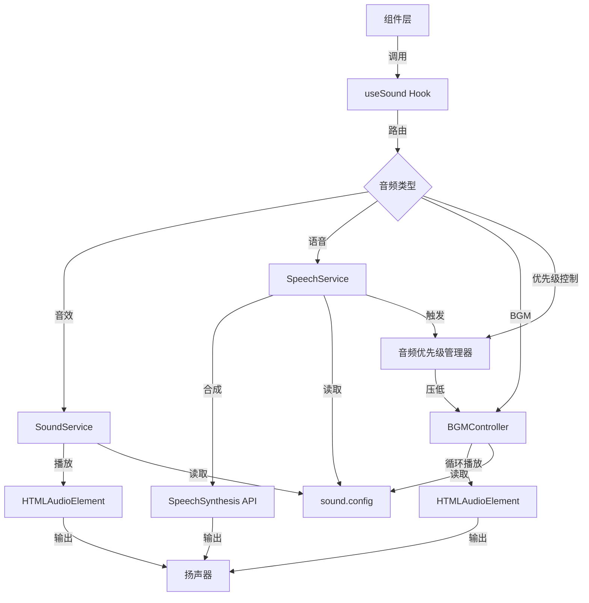

# 炫卡斗士：数学大冒险 V0.3 PRD 文档

**版本**: V0.3 增强版（音效与体验）
**日期**: 2026-03-25
**状态**: 待开发

---

## 1. 产品概述

### 1.1 产品定位
《炫卡斗士：数学大冒险》V0.3 是音效增强版本，在 V0.2.1 完整游戏内容基础上，添加完整的音效系统、背景音乐和语音播放功能，提升游戏沉浸感，让一年级儿童获得更生动的学习体验。

### 1.2 目标用户
- **主要用户**: 6-8 岁小学一年级学生
- **次要用户**: 家长（监督学习进度）、教师（课堂教学辅助）

### 1.3 核心价值
1. **听觉反馈**: 答题正确/错误即时音效，增强学习反馈
2. **沉浸体验**: 背景音乐随场景切换（主菜单/战斗/剧情）
3. **角色语音**: Web Speech API 播放剧情台词，减轻阅读负担
4. **个性绝招**: 21 角色独特绝招音效，增强收集成就感
5. **灵活控制**: 音量独立调节，适应不同使用场景

### 1.4 V0.3 版本范围
| 模块 | 功能 | 优先级 | 状态 |
|------|------|--------|------|
| 背景音乐系统 | 主界面/战斗/胜利/剧情四种 BGM | P0 | 📋 待开发 |
| 答题音效 | 点击/正确/错误/连击/星级音效 | P0 | 📋 待开发 |
| 绝招音效 | 按稀有度分组的 21 角色独特音效 | P0 | 📋 待开发 |
| 语音播放 | Web Speech API 剧情/胜利台词 | P0 | 📋 待开发 |
| 音效设置 | 总开关 + BGM/音效/语音独立音量 | P0 | 📋 待开发 |

### 1.5 不做的事
- ❌ 多人对战音效
- ❌ 成就系统（V0.2.1 已完成）
- ❌ 家长控制面板
- ❌ 自定义音效上传

---

## 2. 功能架构

### 2.1 系统架构图
```
┌─────────────────────────────────────────────────────────────┐
│                    炫卡斗士：数学大冒险 V0.3                  │
├─────────────────────────────────────────────────────────────┤
│  用户界面层                                                   │
│  ┌──────────┐ ┌──────────┐ ┌──────────┐ ┌──────────┐        │
│  │ 关卡选择 │ │ 答题界面 │ │ 战斗界面 │ │ 音效设置 │        │
│  └──────────┘ └──────────┘ └──────────┘ └──────────┘        │
│  ┌──────────┐ ┌──────────┐ ┌──────────┐                     │
│  │ 剧情播放 │ │ 卡牌展示 │ │ 胜利界面 │                     │
│  └──────────┘ └──────────┘ └──────────┘                     │
├─────────────────────────────────────────────────────────────┤
│  音频服务层                                                   │
│  ┌──────────────┐ ┌──────────────┐ ┌──────────────┐         │
│  │ SoundService │ │SpeechService │ │BGMController │         │
│  │  (音效播放)   │ │  (语音合成)   │ │ (背景音乐)   │         │
│  └──────────────┘ └──────────────┘ └──────────────┘         │
│  ┌──────────────────────────────────────────────┐            │
│  │           useSound Hook (组件集成)            │            │
│  └──────────────────────────────────────────────┘            │
├─────────────────────────────────────────────────────────────┤
│  数据与配置层                                                 │
│  ┌──────────────┐ ┌──────────────┐ ┌──────────────┐         │
│  │ sound.config │ │sound.types   │ │storageService│         │
│  │  (音频配置)   │ │  (类型定义)   │ │(设置持久化)  │         │
│  └──────────────┘ └──────────────┘ └──────────────┘         │
├─────────────────────────────────────────────────────────────┤
│  音频资源层                                                   │
│  ┌──────────────┐ ┌──────────────┐ ┌──────────────┐         │
│  │/audio/bg/    │ │/audio/sfx/   │ │/audio/ult/   │         │
│  │  背景音乐    │ │  音效文件    │ │ 绝招音效    │         │
│  └──────────────┘ └──────────────┘ └──────────────┘         │
└─────────────────────────────────────────────────────────────┘
```

### 2.2 音频数据流


**播放优先级**: 语音 (最高) > 音效 (中) > BGM (最低，可被压低)

---

## 3. 功能详细设计

### 3.1 背景音乐系统

#### 3.1.1 BGM 类型定义
```typescript
type BGMType = 'menu' | 'battle' | 'victory' | 'story';

interface BGMConfig {
  type: BGMType;
  src: string;
  loop: boolean;
  volume: number; // 0-1
}
```

#### 3.1.2 BGM 场景映射
| 场景 | BGM 类型 | 播放时机 | 音量 |
|------|----------|----------|------|
| 首页/关卡选择 | menu | 页面挂载时 | 40% |
| 答题战斗 | battle | 进入战斗时 | 50% |
| 胜利结算 | victory | 战斗胜利后 | 60% |
| 剧情播放 | story | 剧情开始时 | 35% |

#### 3.1.3 BGM 控制逻辑
```
┌─────────────────────────────────────────┐
│           BGM 状态机                    │
├─────────────────────────────────────────┤
│                                         │
│   ┌─────────┐    进入战斗    ┌─────────┐│
│   │  menu   │───────────────→│ battle  ││
│   │  (主菜单)│               │ (战斗)  ││
│   └────┬────┘               └────┬────┘│
│        │                         │     │
│   返回首页│                    战斗胜利 │
│        │                         │     │
│        │    ┌─────────┐    ┌────┘     │
│        └───→│  story  │←───│          │
│             │ (剧情)  │    │          │
│             └────┬────┘    │          │
│                  │         │          │
│              剧情结束       │          │
│                  │         │          │
│                  └────┐    │          │
│                   ┌───┴────┴───┐      │
│                   │  victory   │      │
│                   │  (胜利)    │      │
│                   └─────┬──────┘      │
│                         │             │
│                      结算完成          │
│                         │             │
│                         ▼             │
│                      (自动返回 menu)  │
│                                         │
└─────────────────────────────────────────┘
```

#### 3.1.4 BGM 压低机制
当语音播放时，BGM 自动压低到 15% 音量，语音结束后恢复。

### 3.2 音效系统

#### 3.2.1 音效类型定义
```typescript
type SoundType =
  // 答题音效
  | 'correct'      // 答对
  | 'wrong'        // 答错
  | 'click'        // 点击按钮
  | 'combo-1'      // 连击 x1
  | 'combo-5'      // 连击 x5
  | 'combo-10'     // 连击 x10
  // 战斗音效
  | 'card-reveal'  // 卡牌揭示
  | 'star-earn'    // 获得星星
  | 'level-complete' // 关卡完成
  | 'victory'      // 胜利
  | 'defeat'       // 失败
  // 交互音效
  | 'drag'         // 拖拽开始
  | 'drop'         // 放置
  | 'summon'       // 召唤
  | 'transform'    // 变形
  // 绝招音效（按稀有度）
  | 'ultimate-bronze'   // 青铜
  | 'ultimate-silver'   // 白银
  | 'ultimate-gold'     // 黄金
  | 'ultimate-rainbow'  // 彩虹
  | 'ultimate-prismatic'; // 炫彩
```

#### 3.2.2 连击音效触发逻辑
```
连击数    播放音效      视觉效果
─────────────────────────────────────────
1-4      combo-1      普通星星
5-9      combo-5      星星+金色光晕
10+      combo-10     星星+彩虹拖尾
```

#### 3.2.3 组件音效调用矩阵
| 组件 | 触发时机 | 音效类型 |
|------|----------|----------|
| HomePage | 按钮点击 | click |
| LevelSelect | 按钮点击 | click |
| LevelCard | 点击关卡 | click |
| QuizQuestion | 选择答案 | click |
| QuizQuestion | 答对 | correct + star-earn |
| QuizQuestion | 答错 | wrong |
| QuizQuestion | 连击达成 | combo-X |
| BattleScreen | 进入战斗 | BGM: battle |
| StoryPlayer | 剧情播放 | BGM: story |
| LevelComplete | 关卡完成 | level-complete + victory |
| CardReveal | 卡牌揭示 | card-reveal + summon |
| UltimateAnimation | 绝招播放 | ultimate-[rarity] |
| CharacterTransform | 变形 | transform |
| SoundControl | 音量调节 | click |

### 3.3 语音播放系统

#### 3.3.1 语音服务增强
```typescript
interface SpeechConfig {
  text: string;
  speaker?: string;      // 说话人（匹配角色音色）
  priority?: boolean;    // 是否优先播放（压低 BGM）
  onEnd?: () => void;    // 播放完成回调
}

class SpeechService {
  speak(config: SpeechConfig): void;
  stop(): void;
  setEnabled(enabled: boolean): void;
  setVolume(volume: number): void;
  isSpeaking(): boolean;
}
```

#### 3.3.2 角色音色映射
| 角色 | 音色配置 | 特点 |
|------|----------|------|
| 炫蓝闪电 | pitch: 1.2, rate: 1.0 | 智慧导师，活泼友好 |
| 巨力风暴 | pitch: 0.8, rate: 0.9 | 力量守护者，低沉有力 |
| 烈火修罗 | pitch: 0.9, rate: 1.1 | 火焰战士，热情 |
| 暗影特工 | pitch: 0.85, rate: 0.95 | 潜行者，神秘 |
| 旁白 | pitch: 1.0, rate: 1.0 | 标准朗读 |

#### 3.3.3 语音播放场景
| 场景 | 播放内容 | 示例 |
|------|----------|------|
| 剧情对话 | 角色台词 | "小俊，我是炫蓝闪电，让我来指导你！" |
| 胜利宣言 | 守护者认输 | "没想到你数学这么厉害，这张炫卡是你的了！" |
| 答题反馈 | 鼓励语句 | "答对了！你真棒！" / "没关系，再试一次！" |
| 连击提示 | 连击数播报 | "三连击！" / "太厉害了，十连击！" |

### 3.4 绝招音效系统

#### 3.4.1 稀有度音效分组
按稀有度分为 5 组音效，每组包含：
- 蓄力音效（1-2 秒）
- 释放音效（2-3 秒）
- 命中音效（0.5-1 秒）

| 稀有度 | 音效风格 | 示例描述 |
|--------|----------|----------|
| 青铜 | 金属撞击声 | 低沉的机械声 |
| 白银 | 能量聚集声 | 电流滋滋声 |
| 黄金 | 爆发冲击声 | 爆炸+光芒音效 |
| 彩虹 | 魔法变幻声 | 音阶上升+粒子声 |
| 炫彩 | 史诗交响声 | 多层次混音+回响 |

#### 3.4.2 绝招音效触发流程
```
┌─────────────┐    ┌─────────────┐    ┌─────────────┐
│  绝招开始   │───→│   蓄力音效   │───→│  释放音效   │
│             │    │  (循环播放)  │    │  (单次播放) │
└─────────────┘    └─────────────┘    └──────┬──────┘
                                             │
                                             ▼
                                      ┌─────────────┐
                                      │   命中音效   │
                                      │  + 胜利语音  │
                                      └─────────────┘
```

---

## 4. 音效设置 UI

### 4.1 设置面板设计
```
┌─────────────────────────────────────────┐
│         🔊 音效设置                      │
├─────────────────────────────────────────┤
│                                         │
│  ┌─────────────────────────────────┐   │
│  │  🔊 总开关                       │   │
│  │  [==========●====] 开启         │   │
│  └─────────────────────────────────┘   │
│                                         │
│  ┌─────────────────────────────────┐   │
│  │  🎵 背景音乐                     │   │
│  │  [====●==========] 40%          │   │
│  └─────────────────────────────────┘   │
│                                         │
│  ┌─────────────────────────────────┐   │
│  │  🔊 音效                         │   │
│  │  [======●========] 60%          │   │
│  └─────────────────────────────────┘   │
│                                         │
│  ┌─────────────────────────────────┐   │
│  │  🗣️ 语音                         │   │
│  │  [========●======] 80%          │   │
│  └─────────────────────────────────┘   │
│                                         │
│  ┌─────────────────────────────────┐   │
│  │  📳 振动                         │   │
│  │  [==========●====] 开启         │   │
│  └─────────────────────────────────┘   │
│                                         │
│         [保存设置]                      │
│                                         │
└─────────────────────────────────────────┘
```

### 4.2 设置面板交互
| 交互 | 行为 |
|------|------|
| 总开关关闭 | 所有音频立即静音，滑块禁用 |
| 总开关开启 | 恢复上次音量设置，滑块启用 |
| 音量调节 | 实时生效，播放测试音效 |
| 点击保存 | 保存到 localStorage，显示提示 |

---

## 5. 技术实现方案

### 5.1 类型定义
```typescript
// sound.types.ts

export type SoundType =
  | 'correct' | 'wrong' | 'click' | 'card-reveal' | 'star-earn'
  | 'level-complete' | 'transform' | 'drag' | 'drop' | 'summon'
  | 'combo-1' | 'combo-5' | 'combo-10' | 'victory' | 'defeat'
  | 'ultimate-bronze' | 'ultimate-silver' | 'ultimate-gold'
  | 'ultimate-rainbow' | 'ultimate-prismatic';

export type BGMType = 'menu' | 'battle' | 'victory' | 'story';

export interface SoundSettings {
  enabled: boolean;
  sfxVolume: number;    // 音效音量 0-1
  bgmVolume: number;    // BGM 音量 0-1
  speechVolume: number; // 语音音量 0-1
  vibrationEnabled: boolean;
}

export interface SoundConfig {
  sfxFiles: Record<SoundType, string>;
  bgmFiles: Record<BGMType, string>;
  ultimateFiles: Record<string, string>; // characterId -> file
  defaultVolume: {
    sfx: number;
    bgm: number;
    speech: number;
  };
  bgmDuckVolume: number; // 语音播放时 BGM 压低到的音量
}
```

### 5.2 音效服务扩展
```typescript
// sound.service.ts

class SoundService {
  private audioCache: Map<string, HTMLAudioElement> = new Map();
  private currentBGM: HTMLAudioElement | null = null;
  private bgmVolume: number = 0.4;
  private settings: SoundSettings;

  // 全局控制
  setEnabled(enabled: boolean): void;
  setVolume(type: 'sfx' | 'bgm' | 'speech', volume: number): void;
  getSettings(): SoundSettings;

  // 音效播放
  play(type: SoundType): void;
  playCombo(count: number): void;
  playUltimate(characterId: string, rarity: RarityType): void;

  // 背景音乐
  playBGM(type: BGMType): void;
  stopBGM(): void;
  pauseBGM(): void;
  resumeBGM(): void;
  duckBGM(volume: number): void; // 压低 BGM
  unduckBGM(): void; // 恢复 BGM
}
```

### 5.3 语音服务扩展
```typescript
// speech.service.ts

class SpeechService {
  private priorityMode: boolean = true; // 播放时压低 BGM
  private bgmWasPlaying: boolean = false;

  setPriorityMode(enabled: boolean): void;

  speak(text: string, speaker?: string, onEnd?: () => void): void {
    if (this.priorityMode && soundService.isBGMPlaying()) {
      this.bgmWasPlaying = true;
      soundService.duckBGM(0.15);
    }
    // ... 语音合成逻辑
  }

  private onSpeechEnd(): void {
    if (this.bgmWasPlaying) {
      soundService.unduckBGM();
      this.bgmWasPlaying = false;
    }
  }
}
```

### 5.4 Hook 扩展
```typescript
// use-sound.hook.ts

export function useSound() {
  // 原有方法
  const play = useCallback((type: SoundType) => {...}, []);
  const playCorrect = useCallback(() => play('correct'), [play]);
  const playWrong = useCallback(() => play('wrong'), [play]);

  // 新增方法
  const playCombo = useCallback((count: number) => {
    soundService.playCombo(count);
  }, []);

  const playBGM = useCallback((type: BGMType) => {
    soundService.playBGM(type);
  }, []);

  const stopBGM = useCallback(() => {
    soundService.stopBGM();
  }, []);

  const playUltimate = useCallback((characterId: string, rarity: RarityType) => {
    soundService.playUltimate(characterId, rarity);
  }, []);

  const speak = useCallback((text: string, speaker?: string) => {
    return new Promise<void>((resolve) => {
      speechService.speak(text, speaker, () => resolve());
    });
  }, []);

  return {
    // 原有
    play, playCorrect, playWrong, playClick,
    // 新增
    playCombo, playBGM, stopBGM, playUltimate, speak,
  };
}
```

### 5.5 设置持久化
```typescript
// storage.service.ts 扩展

interface UserData {
  // ... 现有字段
  settings: {
    soundEnabled: boolean;
    musicEnabled: boolean;
    vibrationEnabled: boolean;
    // V0.3 新增
    sfxVolume: number;    // 默认 0.7
    bgmVolume: number;    // 默认 0.4
    speechVolume: number; // 默认 0.8
    speechEnabled: boolean; // 默认 true
  };
}

// 迁移函数处理旧数据
createDefaultUserData() {
  return {
    // ...
    settings: {
      soundEnabled: true,
      musicEnabled: true,
      vibrationEnabled: true,
      sfxVolume: 0.7,
      bgmVolume: 0.4,
      speechVolume: 0.8,
      speechEnabled: true,
    },
  };
}
```

---

## 6. 音效资源规划

### 6.1 资源目录结构
```
public/
└── audio/
    ├── bg/
    │   ├── menu-theme.mp3      # 主菜单 BGM
    │   ├── battle-theme.mp3    # 战斗 BGM
    │   ├── victory-theme.mp3   # 胜利 BGM
    │   └── story-theme.mp3     # 剧情 BGM
    ├── sfx/
    │   ├── correct.mp3         # 答对
    │   ├── wrong.mp3           # 答错
    │   ├── click.mp3           # 点击
    │   ├── card-reveal.mp3     # 卡牌揭示
    │   ├── star-earn.mp3       # 获得星星
    │   ├── level-complete.mp3  # 关卡完成
    │   ├── victory.mp3         # 胜利
    │   ├── defeat.mp3          # 失败
    │   ├── combo-1.mp3         # 连击 x1
    │   ├── combo-5.mp3         # 连击 x5
    │   ├── combo-10.mp3        # 连击 x10
    │   ├── drag.mp3            # 拖拽
    │   ├── drop.mp3            # 放置
    │   ├── summon.mp3          # 召唤
    │   └── transform.mp3       # 变形
    └── ultimate/
        ├── bronze.mp3          # 青铜绝招
        ├── silver.mp3          # 白银绝招
        ├── gold.mp3            # 黄金绝招
        ├── rainbow.mp3         # 彩虹绝招
        └── prismatic.mp3       # 炫彩绝招
```

### 6.2 推荐音效资源
| 资源库 | 网址 | 许可证 |
|--------|------|--------|
| Freesound | https://freesound.org/ | CC-BY/CC0 |
| OpenGameArt | https://opengameart.org/ | CC-BY/CC0 |
| Kenney Assets | https://kenney.nl/assets/audio | CC0 |
| BFXR | https://www.bfxr.net/ | 免费 |

---

## 7. 组件集成清单

### 7.1 集成矩阵
| 组件路径 | 音效集成点 |
|----------|-----------|
| features/home/home-page.component.tsx | 首页按钮 click, BGM: menu |
| features/level/level-select.component.tsx | 关卡按钮 click, BGM: menu |
| features/quiz/quiz-question.component.tsx | 答题 correct/wrong/combo, BGM: battle |
| features/story/story-player.component.tsx | 剧情语音 speak, BGM: story |
| features/level/level-complete.component.tsx | 胜利 victory/level-complete/summon, BGM: victory |
| features/card/card-reveal.component.tsx | 卡牌揭示 card-reveal |
| features/character/ultimate-animation.component.tsx | 绝招 ultimate-[rarity] |
| features/character/transform-animation.component.tsx | 变形 transform |
| shared/components/sound-control.component.tsx | 设置 UI，所有控制方法 |

---

## 8. 验收标准

### 8.1 功能验收
| 功能 | 验收标准 | 优先级 | 状态 |
|------|----------|--------|------|
| BGM 播放 | 四种场景 BGM 正常切换 | P0 | ⏳ |
| BGM 循环 | 播放结束自动循环 | P0 | ⏳ |
| BGM 压低 | 语音播放时自动压低到 15% | P0 | ⏳ |
| 音效播放 | 所有音效类型正常播放 | P0 | ⏳ |
| 连击音效 | 连击数 1/5/10 对应不同音效 | P0 | ⏳ |
| 绝招音效 | 按稀有度播放对应音效 | P0 | ⏳ |
| 语音播放 | Web Speech API 正常朗读中文 | P0 | ⏳ |
| 角色音色 | 不同角色有不同 pitch/rate | P1 | ⏳ |
| 设置面板 | 音量调节实时生效 | P0 | ⏳ |
| 设置持久化 | 刷新后设置保持不变 | P0 | ⏳ |
| 总开关 | 关闭后所有音频静音 | P0 | ⏳ |

### 8.2 性能验收
| 指标 | 目标 | 测量方式 |
|------|------|----------|
| 音效延迟 | < 50ms | Performance API |
| 音频加载 | 首次播放前预加载 | 网络面板 |
| 内存占用 | 音频缓存 < 10MB | DevTools Memory |
| 并发播放 | 支持 3 个音效同时播放 | 手动测试 |

### 8.3 兼容性验收
| 平台 | 要求 |
|------|------|
| Chrome 90+ | Web Audio API + Speech API |
| Safari 14+ | Web Audio API + Speech API |
| Edge 90+ | Web Audio API + Speech API |
| iPad Safari | 支持触摸音频播放 |
| Android Chrome | 支持后台音频暂停 |

---

## 9. 附录

### 附录 A: 变更日志

| 版本 | 日期 | 变更内容 | 状态 |
|------|------|----------|------|
| V0.2.1 | 2026-03-21 | 内容增强版（隐藏关卡 + 角色重设计） | ✅ 已完成 |
| V0.3 | 2026-03-25 | 音效增强版（BGM + 音效 + 语音） | 📋 待开发 |

### V0.3 详细变更内容

**新增内容**:
1. **背景音乐系统**: 4 种场景 BGM（menu/battle/victory/story）
2. **答题音效**: correct/wrong/click/star-earn 等 11 种基础音效
3. **连击音效**: combo-1/combo-5/combo-10 三级连击反馈
4. **绝招音效**: 按稀有度分 5 组（bronze/silver/gold/rainbow/prismatic）
5. **语音播放**: Web Speech API 朗读剧情台词
6. **BGM 压低**: 语音播放时自动压低背景音乐
7. **音效设置面板**: 总开关 + BGM/音效/语音 独立音量调节
8. **设置持久化**: localStorage 保存用户音量偏好

**技术变更**:
1. SoundService 扩展 BGM 播放和音量控制
2. SpeechService 扩展优先级模式（BGM 压低）
3. useSound Hook 新增 BGM/语音/连击方法
4. storageService 扩展音效设置字段
5. 新增 SoundControl 设置组件

### 附录 B: 术语表

| 术语 | 定义 |
|------|------|
| BGM | Background Music，背景音乐 |
| SFX | Sound Effects，音效 |
| TTS | Text-to-Speech，文字转语音 |
| AudioContext | Web Audio API 核心对象 |
| SpeechSynthesis | Web Speech API 语音合成接口 |
| BGM Ducking | BGM 压低技术，语音播放时降低背景音乐音量 |
| 连击 | Combo，连续答对题目 |
| 稀有度 | 角色卡牌品质（青铜/白银/黄金/彩虹/炫彩） |

### 附录 C: PRD 总集更新

**PRD 总集路径**: `docs/PRD_REGISTRY.md`

**新增行**:
```
| V0.3 | 炫卡斗士：数学大冒险 V0.3 PRD（音效与体验） | 包含背景音乐系统（4 种场景 BGM）、答题音效（11 种基础音效 + 3 级连击）、绝招音效（5 种稀有度分组）、Web Speech API 语音播放、BGM 压低机制、音效设置面板（总开关 + BGM/音效/语音独立音量）、设置持久化。技术栈扩展：Web Audio API + Web Speech API | docs/prd/V0.3-PRD.md |
```

---

**文档结束**
